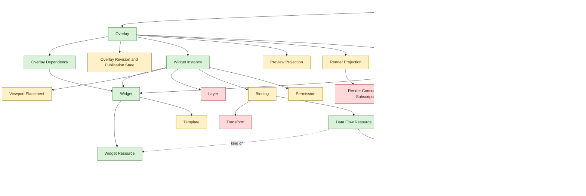

# NEXIS Domain Glossary

This file tracks the current domain vocabulary for NEXIS and the small set of architecture terms needed to keep implementation aligned with that vocabulary.

It distinguishes between:

- concepts that are already defined well enough to act as the current shared language
- concepts that exist but still need sharper boundaries
- concepts that are likely missing and should be defined before the model grows much further

## Browse by section

- [Defined concepts](#defined-concepts)
- [Architecture vocabulary](#architecture-vocabulary)
- [Underdefined concepts](#underdefined-concepts)
- [Missing concepts](#missing-concepts)
- [Recommended first-pass model tree](#recommended-first-pass-model-tree)
- [Domain map](#domain-map)

## Browse by concept

- [Overlay](#overlay)
- [Widget](#widget)
- [Widget resource](#widget-resource)
- [Widget instance](#widget-instance)
- [Overlay dependency](#overlay-dependency)
- [Data scraper](#data-scraper)
- [Data retriever](#data-retriever)
- [Data source](#data-source)
- [Data flow resource](#data-flow-resource)
- [Hexagonal architecture](#hexagonal-architecture)
- [Shared external platform plugin contract](#shared-external-platform-plugin-contract)
- [Port](#port)
- [Normalized capability event envelope](#normalized-capability-event-envelope)
- [Normalized actor account reference](#normalized-actor-account-reference)
- [Canonical actor identity reference](#canonical-actor-identity-reference)
- [Normalized chat source context](#normalized-chat-source-context)
- [Chat events capability port](#chat-events-capability-port)
- [Subscription events capability port](#subscription-events-capability-port)
- [Payment events capability port](#payment-events-capability-port)
- [Social activity events capability port](#social-activity-events-capability-port)
- [Adapter](#adapter)
- [Template](#template)
- [Viewport placement](#viewport-placement)
- [Permission](#permission)
- [Enhancement configuration](#enhancement-configuration)
- [Preview projection](#preview-projection)
- [Render projection](#render-projection)
- [Admin surface](#admin-surface)
- [History, audit, and undo](#history-audit-and-undo)
- [Render mode](#render-mode)
- [Project or workspace](#project-or-workspace)
- [Overlay revision and publication state](#overlay-revision-and-publication-state)
- [Layer](#layer)
- [Binding](#binding)
- [Transform](#transform)
- [Credential or auth grant](#credential-or-auth-grant)
- [Validation issue](#validation-issue)
- [Trigger or automation rule](#trigger-or-automation-rule)
- [Capability policy](#capability-policy)
- [Render consumer or subscription](#render-consumer-or-subscription)
- [Theme profile](#theme-profile)
- [Scene or composition target](#scene-or-composition-target)

## Defined concepts

### Overlay

Status: defined

Current definition:
- A configuration of widget instances composed on top of a video stream.
- The overlay stores widget-instance-specific configuration and an overlay dependency list for the widgets used to create those instances.

Why it is strong:
- It has a clear purpose and a clear relationship to the stream-facing output.
- The PRD already treats it as more than a single panel or isolated component.

Still worth watching:
- It should not become the overloaded root container for every other concern in the system.

Operational expectations:
- The overlay configuration should display its overlay dependency list.
- Importing or activating an overlay should present that overlay dependency list and still allow the user to continue even when some referenced widgets are unavailable.

[Back to top](#nexis-domain-glossary)

### Widget

Status: defined

Current definition:
- A widget proposes to the person creating or modifying an overlay a reusable way to access visual elements or data inside that overlay.
- A widget is the source object from which widget instances are created.
- A widget is importable and exportable outside a specific overlay.

Current capabilities:
- It can hold one or multiple widget resources.
- It can package reusable logic, styles, or event reactions that are shared by the instances created from it.
- It can be distributed as an export package and imported later to become available in the admin interface.

Import and export behavior:
- A widget should expose a full-configuration save or restore mode that covers its whole widget configuration.
- A widget should also expose a data-flow-resource-only save or restore mode that covers only the widget fields backed by data flow resources.
- When a widget participates in pipeline import or export, only the data-flow-resource-only save or restore mode should be used.

Why it is strong:
- It is now clearly distinct from a widget instance.
- It acts as the reusable and portable layer of the model rather than the overlay-scoped configured one.

[Back to top](#nexis-domain-glossary)

### Widget resource

Status: defined

Current definition:
- A widget resource is any reusable resource exposed by a widget for visuals, sounds, animations, data flow resources, or future behaviors.
- Resource kinds are extensible in code, so the widget concept can grow without being redefined each time a new resource kind appears.

Current examples:
- Visual resources, including static code-defined visuals or external image files.
- Sound resources, including static code-defined audio or external sound files.
- Animated resources, including static code-defined animation behavior or external video, GIF, or APNG files.
- Data flow resources, including chat, subscription, or other widget-facing event-driven resources that listen to data sources.
- Future resource kinds and other code-defined behaviors.

Export behavior:
- Each resource kind may expose its own way to be saved when a widget is exported.

[Back to top](#nexis-domain-glossary)

### Data scraper

Status: defined

Current definition:
- A data scraper collects data from a concrete upstream input, formats that collected data into events, and creates exactly one single-domain data source from those events.

Output rule:
- That single-domain data source should contain events from a single coherent event domain.

Examples:
- A Twitch chat scraper creates one data source containing Twitch chat-message events.
- A Twitch follow-notification scraper creates one data source containing Twitch follow events.

Typical origins:
- Local processing
- Watched file contents
- Commands
- APIs
- RSS or Atom feeds
- External event streams such as MQTT

Why it is strong:
- It is the source-side ingestion abstraction of the event pipeline and the first producer of data sources.

[Back to top](#nexis-domain-glossary)

### Data retriever

Status: defined

Current definition:
- A data retriever subscribes to one or more data sources.
- It always depends on at least one upstream data source and always produces exactly one new downstream data source.
- Its subscriptions are non-destructive, so upstream data sources remain available to other data retrievers and data flow resources.
- It filters, transforms, aggregates, or selects the events it receives.
- It produces a new data source from the resulting derived event stream.

Mental model:
- If data sources are flows, data retrievers are selective strips across one or more upstream flows that produce a new downstream flow without reducing the original flows.

[Back to top](#nexis-domain-glossary)

### Data source

Status: defined

Current definition:
- A data source is a source of events created by a data scraper or by a data retriever.
- It is the event-stream abstraction that downstream data retrievers and data flow resources can listen to.

Domain rule:
- A data source should represent a single coherent event domain, even when that domain is derived from one or more upstream data sources.

Why it is strong:
- It is no longer overloaded with the meaning of raw external origin.
- It now has a precise place in the event pipeline.

[Back to top](#nexis-domain-glossary)

### Data flow resource

Status: defined

Current definition:
- A data flow resource is a widget-facing resource that listens to the events of a data source.
- It holds the widget-facing logic needed to extract or transform those events into values that can hydrate widget fields or other widget inputs.
- In the admin pipeline editor, widget-field dots represent data flow resources attached to widget instances.
- Only widget fields backed by data flow resources participate in that editor.
- Unlike a data retriever, it does not create a new data source.

Implementation priority:
- Data scraper, data retriever, data source, and data flow resource support should be available as early as possible in the implementation phase because multiple widget behaviors depend on them.

[Back to top](#nexis-domain-glossary)

### Widget instance

Status: defined

Current definition:
- A widget instance is an overlay-scoped instantiation of a source widget.
- It keeps a reference to its source widget and should update when that source widget is altered.
- It holds only the configuration that is specific to its use inside an overlay.

Typical instance-specific configuration:
- Opacity
- Viewport placement
- Layering or other overlay-scoped visual settings
- Instance-specific behavior rules such as filters or event-selection logic

Storage expectations:
- Widget-instance configuration is not meaningful on its own.
- It should therefore be saved inside the overlay configuration rather than as a standalone exportable object.

[Back to top](#nexis-domain-glossary)

### Overlay dependency

Status: defined

Current definition:
- An overlay dependency is a widget dependency recorded by an overlay because one of its widget instances was created from that widget.
- The overlay dependency list helps users understand which widgets are required for an overlay to function fully.

Operational expectations:
- Overlay configuration should display the overlay dependency list.
- Overlay import or activation should present the overlay dependency list before proceeding.
- The user should be able to continue even when some referenced widgets are missing.

[Back to top](#nexis-domain-glossary)

## Architecture vocabulary

### Hexagonal architecture

Status: defined

Current definition:
- NEXIS should use hexagonal architecture principles.
- The domain model and application rules form the core.
- Presentation and infrastructure should reach that core through ports and adapters rather than by shaping the core directly.

Architectural constraints:
- Domain and application code should not depend directly on React, Bun HTTP, WebSocket, SQLite, filesystem watchers, MQTT clients, or provider-specific APIs and SDKs.
- Provider-specific logic should live in adapters at the boundary of the system.
- Admin and render surfaces should adapt user intent and projected state to the same core model rather than maintaining parallel models.

[Back to top](#nexis-domain-glossary)

### Shared external platform plugin contract

Status: defined

Current definition:
- A shared external platform plugin contract is the common adapter-level contract implemented by external platform integrations.
- It lets new platform adapters be added as plugins without introducing provider-specific ports into the core.

Required fields and responsibilities:
- Identity: stable plugin identifier, human-readable name, provider label, and version.
- Configuration: declared configuration shape, defaults, and validation expectations for credentials, channels, filters, or provider-specific setup.
- Lifecycle: initialization, start, stop, teardown, readiness, and health reporting.
- Capabilities: an explicit declaration of which capability-oriented ports the plugin supports.

Optional responsibilities:
- Capability-specific factories or handlers that connect the plugin to data scrapers or adjacent ingestion paths.
- Runtime metadata useful for discovery, diagnostics, or operator-facing status.

[Back to top](#nexis-domain-glossary)

### Port

Status: defined

Current definition:
- A port is a boundary contract exposed by the core or required from the outside.
- Ports let the core describe what it needs or accepts without naming framework- or provider-specific implementations.

Typical kinds:
- Inbound ports for admin actions, render queries, and other core-facing inputs.
- Outbound ports for persistence, synchronization, runtime services, and external event ingestion.

Plugin and capability guidance:
- External platform integrations should not create provider-specific ports in the core.
- Instead, they should use a shared plugin contract plus a small set of capability-oriented ports that describe what the core actually needs.
- New external platform adapters should be addable by implementing that shared plugin contract and any relevant capability-oriented ports, without changing the core for each provider name.

[Back to top](#nexis-domain-glossary)

### Normalized capability event envelope

Status: underdefined

Current definition:
- A normalized capability event envelope is the common event shape emitted by capability-oriented ports.
- It gives the core and the downstream event pipeline one shared event contract regardless of provider.
- This section intentionally defines normalization concerns first and does not lock the final low-level field list yet.

Current modeling concerns:
- Stable event identification.
- Capability kind.
- Provider and plugin provenance.
- Occurrence and observation timing.
- A normalized source-context reference describing where the event happened.
- Optional upstream identifiers, correlation context, and non-core metadata when needed.

What still needs definition:
- Which of those concerns should become fixed first-class fields.
- Which field names should be stable across all capability-oriented ports.
- What belongs in the shared envelope versus capability-specific payloads or metadata.

[Back to top](#nexis-domain-glossary)

### Normalized actor account reference

Status: underdefined

Current definition:
- A normalized actor account reference is the shared provider-account-scoped actor subshape used by normalized capability events.
- It represents the observed actor account on a specific provider or platform.
- It may optionally link to a broader canonical identity known by NEXIS, but it should not by itself collapse multiple provider accounts into one person or entity.
- This section intentionally frames actor-account normalization as concern-level guidance rather than a finalized field list.

Current modeling concerns:
- Stable actor-account identification.
- Provider-native account identifiers.
- Actor kind.
- Presentation-oriented account fields such as display name, handle, profile, or avatar.
- Role or verification signals when relevant.
- Optional link to a canonical actor identity.

Normalization rules:
- The primary actor-account identifier should be deterministic and provider-account-scoped.
- The observed provider account should remain distinct from the broader person or entity behind that account.
- Display-oriented names should not be treated as identity.
- Normalized handles should be stored without a leading `@`.

What still needs definition:
- Which presentation fields are stable enough to standardize across capabilities.
- Whether role lists should remain one shared model or become partly capability-specific.
- Whether identity links belong directly in normalized events, derived projections, or both.

[Back to top](#nexis-domain-glossary)

### Canonical actor identity reference

Status: underdefined

Current definition:
- A canonical actor identity reference is the NEXIS-level identity subshape used to group multiple normalized actor account references that belong to the same person, entity, or controlled identity.
- It exists so the system can link cross-provider accounts without erasing the observed provider-account origin of an event.

Current modeling concerns:
- Stable NEXIS identity-level identification.
- Identity kind.
- Primary identity-level presentation fields.
- Relationships to one or more normalized actor account references.

Identity rules:
- Multiple normalized actor account references may point to the same canonical actor identity reference.
- The canonical actor identity reference should aggregate accounts; it should not replace the observed actor account in normalized event payloads.

What still needs definition:
- Manual versus automated account-linking flows.
- Conflict resolution when accounts are merged, split, or relinked.
- How much identity metadata belongs in the core model versus projections or admin tooling.

[Back to top](#nexis-domain-glossary)

### Normalized chat source context

Status: underdefined

Current definition:
- A normalized chat source context is the chat-specific source-context subshape used by chat capability events.
- It is the canonical chat-context shape and should be carried in `sourceContext` instead of a separate room-context concept.
- This section intentionally frames chat-context normalization as concern-level guidance rather than a finalized nested field list.

Current modeling concerns:
- Stable chat-context identification.
- Provider-native context identifiers.
- Context kind.
- Primary display or URL fields when useful.
- Required room-level context.
- Optional higher-level space, thread, stream, or owner context.

Normalization rules:
- `sourceContext` is the canonical field for chat source context in the event shape.
- Room-level context should always be present for chat events.
- Space, thread, and stream refinements should only appear when the provider model actually has them.

What still needs definition:
- Which nested reference shapes should be shared across chat and other capabilities.
- How much stream or session state belongs in chat source context.
- Whether owner or broadcaster references should stay embedded or be derived elsewhere.

[Back to top](#nexis-domain-glossary)

### Chat events capability port

Status: defined

Current definition:
- A chat events capability port exposes normalized chat-like events to the core.
- It exists so providers with message or live-chat behavior can plug into the same core-facing contract.

Current modeling concerns:
- Common envelope concerns.
- Observed actor account.
- Message payload.
- `sourceContext` carrying normalized chat source context.
- Message kind.
- Reply linkage.
- Moderation or visibility state when relevant.

[Back to top](#nexis-domain-glossary)

### Subscription events capability port

Status: defined

Current definition:
- A subscription events capability port exposes normalized subscription-, membership-, or follow-like support events to the core.
- It exists so support or audience-commitment events can feed widgets without the core depending on provider-specific names.

Current modeling concerns:
- Common envelope concerns.
- Observed actor account.
- Support kind.
- Tier or level information.
- Tenure or streak information when relevant.
- Gifting or transfer context when relevant.
- Optional support note or message.

[Back to top](#nexis-domain-glossary)

### Payment events capability port

Status: defined

Current definition:
- A payment events capability port exposes normalized payment, donation, tip, or transaction events to the core.
- It exists so financial-support events can feed goals, alerts, and accounting-aware widgets through one core-facing shape.

Current modeling concerns:
- Common envelope concerns.
- Observed actor account when available.
- Payment kind.
- Amount and currency.
- Transaction state.
- Optional message or note.
- Target, campaign, or order context when relevant.
- Transaction or settlement references when relevant.

[Back to top](#nexis-domain-glossary)

### Social activity events capability port

Status: defined

Current definition:
- A social activity events capability port exposes normalized social actions such as posts, boosts, reactions, follows, or community notifications to the core.
- It exists so federated or community-driven platforms can feed a shared activity model without making the core provider-specific.

Current modeling concerns:
- Common envelope concerns.
- Observed actor account.
- Activity kind.
- Object or target reference.
- Content summary or payload.
- Audience or visibility context when relevant.
- Related actor accounts when relevant.

[Back to top](#nexis-domain-glossary)

### Adapter

Status: defined

Current definition:
- An adapter is a presentation or infrastructure implementation of a port.
- Adapters translate between the core model and external systems, frameworks, protocols, or providers.

Adapter categories:
- Presentation adapters such as the admin surface and render surface.
- Infrastructure adapters such as persistence, runtime, transport, and external platform adapters.

Named external platform adapters:
- Discord adapter: integrates Discord-originated messages, reactions, community notifications, or other Discord events into the event pipeline.
- Twitch adapter: integrates Twitch chat, subscriptions, raids, bits, and related stream events.
- YouTube adapter: integrates YouTube chat, memberships, videos, and livestream metadata events.
- PeerTube adapter: integrates PeerTube video, livestream, and federated metadata or event feeds.
- ActivityPub adapter: integrates federated social activities, actors, posts, and notifications.
- TikTok adapter: integrates TikTok live, chat, or content events where platform access permits it.
- PayPal adapter: integrates payment, donation, and transaction events.
- Tipeee or TipeeeStream adapter: integrates tip, donation, goal, and alert events.

Relationship to the event pipeline:
- External platform adapters should typically feed data scrapers or adjacent ingestion paths that create single-domain data sources, rather than embedding provider-specific behavior directly into widgets or the core model.

Port guidance:
- External platform adapters should usually implement one shared plugin contract and then expose whichever capability-oriented ports they support.
- The core should avoid provider-specific ports such as TwitchPort or DiscordPort.
- Capability-oriented ports should model core needs such as chat events, payment events, subscription events, or social-activity events rather than provider names.

[Back to top](#nexis-domain-glossary)

## Underdefined concepts

### Template

Status: underdefined

Current definition:
- The rendering or behavior definition provided by a widget and consumed by its instances.

What still needs definition:
- Whether it is visual-only, behavioral, or both.
- Whether templates are reusable assets, embedded config, or code-level render strategies.

[Back to top](#nexis-domain-glossary)

### Viewport placement

Status: underdefined

Current definition:
- The placement rules that determine where a widget appears on the output viewport.

What still needs definition:
- Anchor semantics
- Units and coordinates
- Width and height rules
- Overflow and collision handling
- Responsive behavior
- Layer ordering

[Back to top](#nexis-domain-glossary)

### Permission

Status: underdefined

Current definition:
- An explicit capability granted to a widget.

What still needs definition:
- Who grants it
- What resource it targets
- What action it authorizes
- Whether it is per widget, per overlay, or policy-based

[Back to top](#nexis-domain-glossary)

### Enhancement configuration

Status: underdefined

Current definition:
- The editable stream-enhancement setup described throughout the PRD.

What still needs definition:
- Whether it is identical to an overlay or a larger root object containing overlays, widgets, data scrapers, data retrievers, data sources, data flow resources, permissions, and publication state.

Why this matters:
- This is currently the largest structural ambiguity in the vocabulary.

[Back to top](#nexis-domain-glossary)

### Preview projection

Status: underdefined

Current definition:
- The preview-facing representation used while editing or validating output.

What still needs definition:
- Whether it reflects draft state, published state, or a selectable revision.
- Whether preview is a domain projection or just a presentation concern.

[Back to top](#nexis-domain-glossary)

### Render projection

Status: underdefined

Current definition:
- The read-only render-facing representation consumed by streaming software.

What still needs definition:
- Whether render always follows the active published revision.
- Whether render mode is part of the domain or only transport and route configuration.

[Back to top](#nexis-domain-glossary)

### Admin surface

Status: underdefined

Current definition:
- The operator-facing editing surface.
- Diagram-addressable elements such as data scrapers, data sources, data retrievers, data flow resources, widgets, and widget instances should use stable persisted identifiers and faithful names rather than synthetic helper labels.
- It may include a dedicated pipeline editor for visualizing and configuring data pipelines, such as a dynamic Sankey or alluvial diagram where data scrapers are the origins of flows, data retrievers are nodes that sit on one or more upstream flows, and widget-field dots represent data flow resources attached to widget instances.
- For event-driven widget hydration, that pipeline editor can act as the primary configuration UI even though the visible diagram is derived from persisted element configuration on data scrapers, data retrievers, data flow resources, widgets, and widget instances rather than stored as a separate shared configuration artifact.
- Retriever nodes should be positioned dynamically from the data sources they depend on and the next downstream dependency or end of the diagram, with their default placement calculated at the midpoint between those dependency boundaries rather than persisting node positions on the retrievers themselves.
- That pipeline editor can support enabling or disabling scrapers and retrievers, greying out disabled flows and affected nodes, routing flows into retriever nodes, configuring retrievers through node-driven modal dialogs, placing widget-field dots directly on the relevant flows so the represented data flow resources update their own binding identifiers, surfacing downstream warning indicators on affected widget-field dots when disabled upstream flows break those bindings, showing widget-instance stickers or cards below the diagram with one dot per data flow resource field, and importing or exporting individual retriever configurations or whole-diagram pipeline configurations.
- Limited visual preferences such as stable accessible color assignments or constrained layout nudges may persist locally per user without becoming part of the shared domain configuration.

What still needs definition:
- Whether this is only a UI boundary or whether it implies an explicit domain context such as draft editing or configuration management.
- How far pipeline visualization should go beyond inspection into direct manipulation and configuration.
- Which local-only layout preferences are worth persisting per user and which should always be recalculated.

[Back to top](#nexis-domain-glossary)

### Binding

Status: underdefined

Current definition:
- A binding is element-owned derived configuration that connects a widget field or widget input to a data flow resource and, through it, to one or more data sources.
- Retriever configurations should persist their own upstream-data-source binding identifiers, and data flow resource configurations should persist their own ingested-data-source binding identifiers, rather than storing separate diagram-only connection objects.
- In the admin pipeline editor, bindings are manipulated by placing widget-field dots directly on the relevant flows so the represented data flow resource updates its own binding identifier and ingests events from the flow it is placed on.
- Importing or exporting whole-diagram pipeline configurations should use an archive that bundles each participating element's own serialized import or export format, rather than inventing a separate whole-diagram binding schema.

What still needs definition:
- The exact archive container conventions, manifest shape if any, and file naming rules.
- Whether any non-data-flow-resource widget inputs should ever participate in the pipeline editor.
- How manual inputs, fallback values, and degraded states participate in a binding.

[Back to top](#nexis-domain-glossary)

### History, audit, and undo

Status: underdefined

Current definition:
- The append-only, auditable change model intended for future app state handling.
- Undo should append compensating accepted changes rather than rewrite prior history, including reverting propagated downstream pipeline effects when the originating change is undone.

What still needs definition:
- Core nouns such as command, event, history entry, revision, snapshot, publication action, and audit entry.

[Back to top](#nexis-domain-glossary)

### Render mode

Status: underdefined

Current definition:
- A parameter on the render route.

What still needs definition:
- Whether it is a first-class domain concept with named semantics or just a route implementation detail.

[Back to top](#nexis-domain-glossary)

## Missing concepts

### Project or workspace

Status: missing

Why it is needed:
- The model likely needs a root object above overlays, widgets, data scrapers, data retrievers, data sources, data flow resources, credentials, and publication state.

Candidate role:
- Main aggregate root for all user-managed configuration.

[Back to top](#nexis-domain-glossary)

### Overlay revision and publication state

Status: missing

Why it is needed:
- The PRD implies draft, active, and published distinctions but does not name them explicitly.

Candidate states:
- draft
- published
- active
- archived

[Back to top](#nexis-domain-glossary)

### Layer

Status: missing

Why it is needed:
- Placement alone is not enough for compositing; overlays also need ordering.

[Back to top](#nexis-domain-glossary)

### Transform

Status: missing

Why it is needed:
- The system expects derived values, formatting, merging, filtering, and computation before rendering.

[Back to top](#nexis-domain-glossary)

### Credential or auth grant

Status: missing

Why it is needed:
- External sources will eventually require authentication and secret management.

[Back to top](#nexis-domain-glossary)

### Validation issue

Status: missing

Why it is needed:
- Invalid configurations and degraded states are already part of the product expectations, but there is no explicit domain concept for warnings, errors, or blocking issues.

[Back to top](#nexis-domain-glossary)

### Trigger or automation rule

Status: missing

Why it is needed:
- If widgets can affect overlay behavior or react to runtime conditions, rule-driven activation will likely become necessary.

[Back to top](#nexis-domain-glossary)

### Capability policy

Status: missing

Why it is needed:
- Per-widget permission alone may not be enough. A higher-level policy model can describe what categories of behavior are ever allowed.

[Back to top](#nexis-domain-glossary)

### Render consumer or subscription

Status: missing

Why it is needed:
- Future render synchronization likely needs a first-class concept for consumers, sessions, or subscriptions.

[Back to top](#nexis-domain-glossary)

### Theme profile

Status: missing

Why it is needed:
- Theme and presentation configuration may remain purely presentational, but if users manage it as data then it becomes part of the domain model.

[Back to top](#nexis-domain-glossary)

### Scene or composition target

Status: missing

Why it is needed:
- This is optional, but it may become a useful term if the product aligns more directly with streamer mental models and scene-specific output targets.

[Back to top](#nexis-domain-glossary)

## Recommended first-pass model tree

1. Project or workspace
2. Overlay
3. Overlay dependency
4. Overlay revision and publication state
5. Widget
6. Widget resource
7. Data scraper
8. Data retriever
9. Data source
10. Data flow resource
11. Widget instance
12. Template
13. Viewport placement
14. Layer
15. Binding
16. Transform
17. Credential or auth grant
18. Permission
19. Capability policy
20. Preview projection
21. Render projection
22. Render consumer or subscription

[Back to top](#nexis-domain-glossary)

## Domain map

