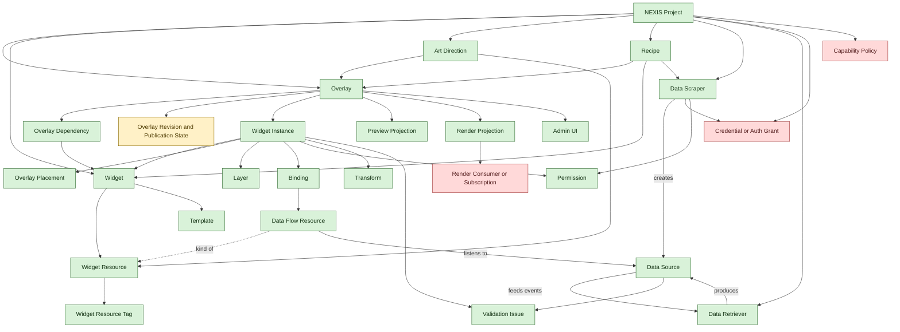

# NEXIS Domain Glossary

This file tracks the current domain vocabulary for NEXIS and the small set of architecture terms needed to keep implementation aligned with that vocabulary.

It distinguishes between:

- concepts that are already defined well enough to act as the current shared language
- concept areas that still need sharper boundaries or structural cleanup even when some individual entries inside them are already defined
- concepts that are likely missing and should be defined before the model grows much further

## Browse by section

- [Core concepts](#core-concepts)
- [Architecture vocabulary](#architecture-vocabulary)
- [Underdefined concepts](#underdefined-concepts)
- [Missing concepts](#missing-concepts)
- [Recommended first-pass model tree](#recommended-first-pass-model-tree)
- [Domain map](#domain-map)

## Browse by level definition

Maintenance instruction:
- Whenever a glossary term status changes, update this Browse by level definition section in the same edit.

### Defined:
  - [NEXIS project](#nexis-project)
  - [Overlay](#overlay)
  - [Widget](#widget)
  - [Widget resource](#widget-resource)
  - [Art Direction](#art-direction)
  - [Widget resource tag](#widget-resource-tag)
  - [Recipe](#recipe)
  - [Data scraper](#data-scraper)
  - [Data retriever](#data-retriever)
  - [Data source](#data-source)
  - [Data flow resource](#data-flow-resource)
  - [Widget instance](#widget-instance)
  - [Template](#template)
  - [Enhancement configuration](#enhancement-configuration)
  - [Preview projection](#preview-projection)
  - [Render projection](#render-projection)
  - [Admin UI](#admin-ui)
  - [Binding](#binding)
  - [Overlay placement](#overlay-placement)
  - [Layer](#layer)
  - [Transform](#transform)
  - [Validation issue](#validation-issue)
  - [Serialized format version](#serialized-format-version)
  - [Local TLS asset](#local-tls-asset)
  - [Permission](#permission)
  - [Overlay dependency](#overlay-dependency)
  - [Hexagonal architecture](#hexagonal-architecture)
  - [Shared external platform plugin contract](#shared-external-platform-plugin-contract)
  - [Port](#port)
  - [Normalized capability event envelope](#normalized-capability-event-envelope)
  - [Normalized actor account reference](#normalized-actor-account-reference)
  - [Canonical actor identity reference](#canonical-actor-identity-reference)
  - [Normalized chat source context](#normalized-chat-source-context)
  - [Chat events capability port](#chat-events-capability-port)
  - [Subscription events capability port](#subscription-events-capability-port)
  - [Payment events capability port](#payment-events-capability-port)
  - [Social activity events capability port](#social-activity-events-capability-port)
  - [Adapter](#adapter)

### Underdefined:
  - [Pipeline archive manifest](#pipeline-archive-manifest)
  - [History, audit, and undo](#history-audit-and-undo)
  - [Overlay revision and publication state](#overlay-revision-and-publication-state)
  - [Credential or auth grant](#credential-or-auth-grant)

### Missing:
  - [Trigger or automation rule](#trigger-or-automation-rule)
  - [Capability policy](#capability-policy)
  - [Render consumer or subscription](#render-consumer-or-subscription)

## Browse by concept

- [NEXIS project](#nexis-project)
- [Overlay](#overlay)
- [Widget](#widget)
- [Widget resource](#widget-resource)
- [Art Direction](#art-direction)
- [Widget resource tag](#widget-resource-tag)
- [Widget instance](#widget-instance)
- [Overlay dependency](#overlay-dependency)
- [Recipe](#recipe)
- [Data scraper](#data-scraper)
- [Data retriever](#data-retriever)
- [Data source](#data-source)
- [Data flow resource](#data-flow-resource)
- [Hexagonal architecture](#hexagonal-architecture)
- [Shared external platform plugin contract](#shared-external-platform-plugin-contract)
- [Port](#port)
- [Normalized capability event envelope](#normalized-capability-event-envelope)
- [Normalized actor account reference](#normalized-actor-account-reference)
- [Canonical actor identity reference](#canonical-actor-identity-reference)
- [Normalized chat source context](#normalized-chat-source-context)
- [Chat events capability port](#chat-events-capability-port)
- [Subscription events capability port](#subscription-events-capability-port)
- [Payment events capability port](#payment-events-capability-port)
- [Social activity events capability port](#social-activity-events-capability-port)
- [Adapter](#adapter)
- [Template](#template)
- [Overlay placement](#overlay-placement)
- [Permission](#permission)
- [Enhancement configuration](#enhancement-configuration)
- [Preview projection](#preview-projection)
- [Render projection](#render-projection)
- [Admin UI](#admin-ui)
- [History, audit, and undo](#history-audit-and-undo)
- [Overlay revision and publication state](#overlay-revision-and-publication-state)
- [Layer](#layer)
- [Binding](#binding)
- [Pipeline archive manifest](#pipeline-archive-manifest)
- [Serialized format version](#serialized-format-version)
- [Transform](#transform)
- [Validation issue](#validation-issue)
- [Credential or auth grant](#credential-or-auth-grant)
- [Local TLS asset](#local-tls-asset)
- [Trigger or automation rule](#trigger-or-automation-rule)
- [Capability policy](#capability-policy)
- [Render consumer or subscription](#render-consumer-or-subscription)
- [Theme profile](#theme-profile)

## Core concepts

### NEXIS project

Status: defined

Current definition:
- A NEXIS project is the main aggregate root for all user-managed configuration.
- It owns the current enhancement configuration together with the user-managed assets and records around it, such as reusable widgets, overlays, Art Directions, recipes, and credentials or auth grants.
- It is the top-level thing the application creates, opens, duplicates, resets, saves, or persists for a user.

Clarification:
- Enhancement configuration is the operator-facing editable setup inside a NEXIS project rather than the broader root aggregate itself.

[Back to top](#nexis-domain-glossary)

### Overlay

Status: defined

Current definition:
- A configuration of widget instances composed on top of a video stream.
- The overlay is the stream-facing composition target for those widget instances, so the current domain model does not need a separate Scene-style target concept.
- The overlay stores widget-instance-specific configuration and an overlay dependency list for the widgets used to create those instances.

Why it is strong:
- It has a clear purpose and a clear relationship to the stream-facing output.
- The PRD already treats it as more than a single panel or isolated component.

Still worth watching:
- It should not become the overloaded root container for every other concern in the system.

Operational expectations:
- The overlay configuration should display its overlay dependency list.
- Importing or activating an overlay should present that overlay dependency list and still allow the user to continue even when some referenced widgets are unavailable.

[Back to top](#nexis-domain-glossary)

### Widget

Status: defined

Current definition:
- A widget proposes to the person creating or modifying an overlay a reusable way to access visual elements or data inside that overlay.
- A widget is the source object from which widget instances are created.
- A widget is importable and exportable outside a specific overlay.

Current role:
- A widget provides the widget-owned template used to create and configure its widget instances.

Current capabilities:
- It can hold one or multiple widget resources.
- It can package reusable logic, styles, or event reactions that are shared by the instances created from it.
- It can be distributed as an export package and imported later to become available in the admin interface.

Import and export behavior:
- A widget should expose a full-configuration save or restore mode that covers its whole widget configuration.
- A widget should also expose a data-flow-resource-only save or restore mode that covers only the widget fields backed by data flow resources.
- Any widget save or restore payload should carry a widget serialized format version string that is independent from the app version.
- When a widget participates in pipeline import or export, only the data-flow-resource-only save or restore mode should be used.

Why it is strong:
- It is now clearly distinct from a widget instance.
- It acts as the reusable and portable layer of the model rather than the overlay-scoped configured one.

[Back to top](#nexis-domain-glossary)

### Widget resource

Status: defined

Current definition:
- A widget resource is any reusable resource exposed by a widget for visuals, sounds, animations, data flow resources, or future behaviors.
- Resource kinds are extensible in code, so the widget concept can grow without being redefined each time a new resource kind appears.

Current examples:
- Visual resources, including static code-defined visuals or external image files.
- Sound resources, including static code-defined audio or external sound files.
- Animated resources, including static code-defined animation behavior or external video, GIF, or APNG files.
- Data flow resources, including chat, subscription, or other widget-facing event-driven resources that listen to data sources.
- Future resource kinds and other code-defined behaviors.

Export behavior:
- Each resource kind may expose its own way to be saved when a widget is exported.

[Back to top](#nexis-domain-glossary)

### Art Direction

Status: defined

Current definition:
- An Art Direction is a reusable package of overlays plus design-oriented widget resources, such as images, animated assets, and sounds, that can be imported, exported, and reapplied as one archive.
- It exists so users can apply a coherent visual style without rebuilding the same presentation choices manually.
- An Art Direction should declare its dependencies so the UI can show which widgets and resource types it supports before the user chooses what to override.

Behavior expectations:
- Importing or applying an Art Direction should allow the user to choose which current widget resources to override.
- Even when a user skips a specific override, imported Art Direction resources should remain available for compatible resource field types covered by that Art Direction.
- If imported overlays would collide by name with existing overlays, the imported overlays should receive a numeric suffix or increment an existing numeric suffix rather than overwriting the current overlays implicitly.
- Art Direction import and export should use an archive containing a manifest with the usual archive metadata plus the selected widget resources tagged as `art`, with each selected resource exported through its own settings-export mechanism.
- Art Directions should not introduce revision management by default.
- Re-applying an Art Direction should open a modal flow that lists the impacted widgets and presents a checkbox for each one so the user can choose which widgets receive the Art Direction settings.

[Back to top](#nexis-domain-glossary)

### Widget resource tag

Status: defined

Current definition:
- A widget resource tag is a core-standardized classification attached to a widget resource to describe what kinds of workflows that resource can participate in.
- The only allowed tag kinds are `art`, `data`, and an Art Direction provenance tag derived from the Art Direction name.
- Widget resources may carry only those core-standardized tag kinds rather than arbitrary new tag names.
- Tags should not be arbitrarily edited by end users, because they describe the resource contract rather than a user preference.

Behavior expectations:
- Widget resource tags should help the UI decide which resources are eligible for Art Direction packaging or data-flow configuration.
- Applying an Art Direction should associate a provenance tag based on the Art Direction name so the UI can show which resources currently come from that Art Direction.
- If an Art Direction is named `art` or `data`, its provenance tag should be turned into `[name] + Art Direction` so it does not collide with the reserved workflow tags.

[Back to top](#nexis-domain-glossary)

### Data scraper

Status: defined

Current definition:
- A data scraper collects data from a concrete upstream input, formats that collected data into events, and creates exactly one single-domain data source from those events.

Output rule:
- That single-domain data source should contain events from a single coherent event domain.

Health expectations:
- A data scraper should report its own health using source-specific checks that matter for its concrete upstream input.
- A scraper connected to a remote API may report connection stability or request viability, while a scraper reading a file may report whether that file remains readable.
- A data scraper should also judge whether the health of the data source it produces is still good enough to be useful.
- If that health becomes too poor, the data source produced by the scraper should be considered halted.
- If that data source later becomes healthy enough again, the scraper should emit a recovery health event in that same event stream.

Examples:
- A Twitch chat scraper creates one data source containing Twitch chat-message events.
- A Twitch follow-notification scraper creates one data source containing Twitch follow events.

Typical origins:
- Local processing
- Watched file contents
- Commands
- APIs
- RSS or Atom feeds
- External event streams such as MQTT

Why it is strong:
- It is the source-side ingestion abstraction of the event pipeline and the first producer of data sources.

[Back to top](#nexis-domain-glossary)

### Data retriever

Status: defined

Current definition:
- A data retriever subscribes to one or more data sources.
- It always depends on at least one upstream data source and always produces exactly one new downstream data source.
- Its subscriptions are non-destructive, so upstream data sources remain available to other data retrievers and data flow resources.
- It filters, transforms, aggregates, or selects the events it receives.
- It produces a new data source from the resulting derived event stream.

Health behavior:
- Upstream health and halt propagation downstream should be automatic pipeline behavior rather than retriever-specific filtering or transformation logic.
- When a data retriever depends on one or more upstream data sources and any one of them remains halted or unhealthy, the retriever process should itself be halted.
- While halted for upstream health reasons, the retriever should stop processing its ordinary targeted events instead of continuing to process the other upstream sources it depends on.
- When an upstream halted or unhealthy data source emits a recovery health event, the retriever may resume processing.
- Health, halt, and recovery events from upstream data sources should be propagated automatically into the event stream of the downstream data source the retriever produces.

Mental model:
- If data sources are flows, data retrievers are selective strips across one or more upstream flows that produce a new downstream flow without reducing the original flows.

[Back to top](#nexis-domain-glossary)

### Data source

Status: defined

Current definition:
- A data source is a source of events created by a data scraper or by a data retriever.
- It is the event-stream abstraction that downstream data retrievers and data flow resources can listen to.

Domain rule:
- A data source should represent a single coherent event domain, even when that domain is derived from one or more upstream data sources.

Health behavior:
- A data source created by a data scraper may be considered halted when that scraper reports health too poor for the source to remain useful.
- A data source has one event stream rather than a separate health-status channel beside its ordinary events.
- Health, halt, and recovery events belong to that same event stream.
- When a data source is halted for health reasons, a health or halt event should be emitted in that event stream so widgets can surface understandable degraded behavior.
- When a halted or unhealthy data source becomes healthy enough again, it should emit a recovery health event in that same event stream.

Why it is strong:
- It is no longer overloaded with the meaning of raw external origin.
- It now has a precise place in the event pipeline.

[Back to top](#nexis-domain-glossary)

### Data flow resource

Status: defined

Current definition:
- A data flow resource is a widget-facing resource that listens to the events of a data source.
- It holds the widget-facing logic needed to extract or transform those events into values that can hydrate widget fields or other widget inputs.
- In the admin pipeline editor, widget-field dots represent data flow resources attached to widget instances.
- Only widget fields backed by data flow resources participate in that editor.
- Unlike a data retriever, it does not create a new data source.

Implementation priority:
- Data scraper, data retriever, data source, and data flow resource support should be available as early as possible in the implementation phase because multiple widget behaviors depend on them.

[Back to top](#nexis-domain-glossary)

### Widget instance

Status: defined

Current definition:
- A widget instance is an overlay-scoped instantiation of a source widget.
- It keeps a reference to its source widget and should update when that source widget is altered.
- It holds only the configuration that is specific to its use inside an overlay.

Typical instance-specific configuration:
- Opacity
- Overlay placement
- Layering or other overlay-scoped visual settings
- Instance-specific behavior rules such as filters or event-selection logic

Storage expectations:
- Widget-instance configuration is not meaningful on its own.
- It should therefore be saved inside the overlay configuration rather than as a standalone exportable object.

[Back to top](#nexis-domain-glossary)

### Overlay dependency

Status: defined

Current definition:
- An overlay dependency is a widget dependency recorded by an overlay because one of its widget instances was created from that widget.
- The overlay dependency list helps users understand which widgets are required for an overlay to function fully.

Operational expectations:
- Overlay configuration should display the overlay dependency list.
- Overlay import or activation should present the overlay dependency list before proceeding.
- The user should be able to continue even when some referenced widgets are missing.

[Back to top](#nexis-domain-glossary)

### Recipe

Status: defined

Current definition:
- A recipe is a reusable application-configuration starter that orchestrates one or more overlays, widgets, data scrapers, data retrievers, and related configuration through the app-level shared state.
- It exists to improve onboarding by giving new users guided starting points instead of forcing them to configure the application from scratch.
- A recipe may be bundled with the app for common starter scenarios or imported from an external recipe archive for more advanced setups.

Format expectations:
- Recipe imports and exports should use an archive-based format so one recipe can carry its configuration and related resources as a single file.
- That archive should center on a main TypeScript recipe file that builds the next app state by issuing commands comparable to the ones the UI would trigger.

Behavior expectations:
- The welcome page should be able to present beginner-friendly bundled recipes as well as import paths for more advanced recipe archives.
- Loading a recipe should run a guided recipe wizard that prompts for any required data-scraper configuration and account linking before the recipe is considered ready.
- When possible, account linking inside that wizard should be grouped into a single checklist-style step.
- Applying a recipe should always create new overlays, using the existing numeric-suffix naming rule when overlay names collide.
- Applying or re-applying a recipe should override data scrapers, data retrievers, and widget configurations with the recipe-defined configuration rather than trying to merge user customizations.
- Re-applying a recipe after customization should treat the recipe as a sane default and restore the recipe-defined configuration over those customizations.

[Back to top](#nexis-domain-glossary)

## Architecture vocabulary

### Hexagonal architecture

Status: defined

Current definition:
- NEXIS should use hexagonal architecture principles.
- The domain model and application rules form the core.
- Presentation and infrastructure should reach that core through ports and adapters rather than by shaping the core directly.

Architectural constraints:
- Domain and application code should not depend directly on React, Bun HTTP, WebSocket, SQLite, filesystem watchers, MQTT clients, or provider-specific APIs and SDKs.
- Provider-specific logic should live in adapters at the boundary of the system.
- Admin and render UIs should adapt user intent and projected state to the same core model rather than maintaining parallel models.

[Back to top](#nexis-domain-glossary)

### Shared external platform plugin contract

Status: defined

Current definition:
- A shared external platform plugin contract is the common adapter-level contract implemented by external platform integrations.
- It lets new platform adapters be added as plugins without introducing provider-specific ports into the core.

Required fields and responsibilities:
- Identity: stable plugin identifier, human-readable name, provider label, and version.
- Configuration: declared configuration shape, defaults, and validation expectations for credentials, channels, filters, or provider-specific setup.
- Lifecycle: initialization, start, stop, teardown, readiness, and health reporting.
- Capabilities: an explicit declaration of which capability-oriented ports the plugin supports.

Optional responsibilities:
- Capability-specific factories or handlers that connect the plugin to data scrapers or adjacent ingestion paths.
- Runtime metadata useful for discovery, diagnostics, or operator-facing status.
- If the plugin exposes importable or exportable artifacts, declarations of their serializers and serialized format version strings.

[Back to top](#nexis-domain-glossary)

### Port

Status: defined

Current definition:
- A port is a boundary contract exposed by the core or required from the outside.
- Ports let the core describe what it needs or accepts without naming framework- or provider-specific implementations.

Typical kinds:
- Inbound ports for admin actions, render queries, and other core-facing inputs.
- Outbound ports for persistence, synchronization, runtime services, and external event ingestion.

Plugin and capability guidance:
- External platform integrations should not create provider-specific ports in the core.
- Instead, they should use a shared plugin contract plus a small set of capability-oriented ports that describe what the core actually needs.
- New external platform adapters should be addable by implementing that shared plugin contract and any relevant capability-oriented ports, without changing the core for each provider name.

[Back to top](#nexis-domain-glossary)

### Normalized capability event envelope

Status: underdefined

Current definition:
- A normalized capability event envelope is the common event shape emitted by capability-oriented ports.
- It gives the core and the downstream event pipeline one shared event contract regardless of provider.
- This section intentionally defines normalization concerns first and does not lock the final low-level field list yet.

Current modeling concerns:
- Stable event identification.
- Capability kind.
- Provider and plugin provenance.
- Occurrence and observation timing.
- A normalized source-context reference describing where the event happened.
- Optional upstream identifiers, correlation context, and non-core metadata when needed.

What still needs definition:
- Which of those concerns should become fixed first-class fields.
- Which field names should be stable across all capability-oriented ports.
- What belongs in the shared envelope versus capability-specific payloads or metadata.

[Back to top](#nexis-domain-glossary)

### Normalized actor account reference

Status: underdefined

Current definition:
- A normalized actor account reference is the shared provider-account-scoped actor subshape used by normalized capability events.
- It represents the observed actor account on a specific provider or platform.
- It may optionally link to a broader canonical identity known by NEXIS, but it should not by itself collapse multiple provider accounts into one person or entity.
- This section intentionally frames actor-account normalization as concern-level guidance rather than a finalized field list.

Current modeling concerns:
- Stable actor-account identification.
- Provider-native account identifiers.
- Actor kind.
- Presentation-oriented account fields such as display name, handle, profile, or avatar.
- Role or verification signals when relevant.
- Optional link to a canonical actor identity.

Normalization rules:
- The primary actor-account identifier should be deterministic and provider-account-scoped.
- The observed provider account should remain distinct from the broader person or entity behind that account.
- Display-oriented names should not be treated as identity.
- Normalized handles should be stored without a leading `@`.

What still needs definition:
- Which presentation fields are stable enough to standardize across capabilities.
- Whether role lists should remain one shared model or become partly capability-specific.
- Whether identity links belong directly in normalized events, derived projections, or both.

[Back to top](#nexis-domain-glossary)

### Canonical actor identity reference

Status: underdefined

Current definition:
- A canonical actor identity reference is the NEXIS-level identity subshape used to group multiple normalized actor account references that belong to the same person, entity, or controlled identity.
- It exists so the system can link cross-provider accounts without erasing the observed provider-account origin of an event.

Current modeling concerns:
- Stable NEXIS identity-level identification.
- Identity kind.
- Primary identity-level presentation fields.
- Relationships to one or more normalized actor account references.

Identity rules:
- Multiple normalized actor account references may point to the same canonical actor identity reference.
- The canonical actor identity reference should aggregate accounts; it should not replace the observed actor account in normalized event payloads.

What still needs definition:
- Manual versus automated account-linking flows.
- Conflict resolution when accounts are merged, split, or relinked.
- How much identity metadata belongs in the core model versus projections or admin tooling.

[Back to top](#nexis-domain-glossary)

### Normalized chat source context

Status: underdefined

Current definition:
- A normalized chat source context is the chat-specific source-context subshape used by chat capability events.
- It is the canonical chat-context shape and should be carried in `sourceContext` instead of a separate room-context concept.
- This section intentionally frames chat-context normalization as concern-level guidance rather than a finalized nested field list.

Current modeling concerns:
- Stable chat-context identification.
- Provider-native context identifiers.
- Context kind.
- Primary display or URL fields when useful.
- Required room-level context.
- Optional higher-level space, thread, stream, or owner context.

Normalization rules:
- `sourceContext` is the canonical field for chat source context in the event shape.
- Room-level context should always be present for chat events.
- Space, thread, and stream refinements should only appear when the provider model actually has them.

What still needs definition:
- Which nested reference shapes should be shared across chat and other capabilities.
- How much stream or session state belongs in chat source context.
- Whether owner or broadcaster references should stay embedded or be derived elsewhere.

[Back to top](#nexis-domain-glossary)

### Chat events capability port

Status: defined

Current definition:
- A chat events capability port exposes normalized chat-like events to the core.
- It exists so providers with message or live-chat behavior can plug into the same core-facing contract.

Current modeling concerns:
- Common envelope concerns.
- Observed actor account.
- Message payload.
- `sourceContext` carrying normalized chat source context.
- Message kind.
- Reply linkage.
- Moderation or visibility state when relevant.

[Back to top](#nexis-domain-glossary)

### Subscription events capability port

Status: defined

Current definition:
- A subscription events capability port exposes normalized subscription-, membership-, or follow-like support events to the core.
- It exists so support or audience-commitment events can feed widgets without the core depending on provider-specific names.

Current modeling concerns:
- Common envelope concerns.
- Observed actor account.
- Support kind.
- Tier or level information.
- Tenure or streak information when relevant.
- Gifting or transfer context when relevant.
- Optional support note or message.

[Back to top](#nexis-domain-glossary)

### Payment events capability port

Status: defined

Current definition:
- A payment events capability port exposes normalized payment, donation, tip, or transaction events to the core.
- It exists so financial-support events can feed goals, alerts, and accounting-aware widgets through one core-facing shape.

Current modeling concerns:
- Common envelope concerns.
- Observed actor account when available.
- Payment kind.
- Amount and currency.
- Transaction state.
- Optional message or note.
- Target, campaign, or order context when relevant.
- Transaction or settlement references when relevant.

[Back to top](#nexis-domain-glossary)

### Social activity events capability port

Status: defined

Current definition:
- A social activity events capability port exposes normalized social actions such as posts, boosts, reactions, follows, or community notifications to the core.
- It exists so federated or community-driven platforms can feed a shared activity model without making the core provider-specific.

Current modeling concerns:
- Common envelope concerns.
- Observed actor account.
- Activity kind.
- Object or target reference.
- Content summary or payload.
- Audience or visibility context when relevant.
- Related actor accounts when relevant.

[Back to top](#nexis-domain-glossary)

### Adapter

Status: defined

Current definition:
- An adapter is a presentation or infrastructure implementation of a port.
- Adapters translate between the core model and external systems, frameworks, protocols, or providers.

Adapter categories:
- Presentation adapters such as the admin UI and render UI.
- Infrastructure adapters such as persistence, runtime, transport, and external platform adapters.

Named external platform adapters:
- Discord adapter: integrates Discord-originated messages, reactions, community notifications, or other Discord events into the event pipeline.
- Twitch adapter: integrates Twitch chat, subscriptions, raids, bits, and related stream events.
- YouTube adapter: integrates YouTube chat, memberships, videos, and livestream metadata events.
- PeerTube adapter: integrates PeerTube video, livestream, and federated metadata or event feeds.
- ActivityPub adapter: integrates federated social activities, actors, posts, and notifications.
- TikTok adapter: integrates TikTok live, chat, or content events where platform access permits it.
- PayPal adapter: integrates payment, donation, and transaction events.
- Tipeee or TipeeeStream adapter: integrates tip, donation, goal, and alert events.

Relationship to the event pipeline:
- External platform adapters should typically feed data scrapers or adjacent ingestion paths that create single-domain data sources, rather than embedding provider-specific behavior directly into widgets or the core model.

Port guidance:
- External platform adapters should usually implement one shared plugin contract and then expose whichever capability-oriented ports they support.
- The core should avoid provider-specific ports such as TwitchPort or DiscordPort.
- Capability-oriented ports should model core needs such as chat events, payment events, subscription events, or social-activity events rather than provider names.

[Back to top](#nexis-domain-glossary)

## Underdefined concepts

This section also holds nearby concepts whose surrounding model is still settling, even when an individual term inside the section has already been clarified enough to count as defined.

### Template

Status: defined

Current definition:
- A template is the widget-provided blueprint that defines what a widget contributes when creating its widget instances.
- It defines the render or behavior structure a widget instance uses.
- It also defines the instance-side configuration shape and form used when configuring those widget instances.

Current behavior:
- A widget should provide its template as part of the widget definition.
- Widget instances should be created from the template provided by their source widget.
- The widget-instance configuration UI should be derived from the template-defined instance configuration form.
- For now, a template should be treated as widget-owned rather than as a standalone reusable artifact separate from the widget.

[Back to top](#nexis-domain-glossary)

### Overlay placement

Status: defined

Current definition:
- The placement rules that determine where a widget instance appears inside an overlay.

Current behavior:
- An overlay should expose nine primary snapping zones: top-left, top-center, top-right, middle-left, middle-center, middle-right, bottom-left, bottom-center, and bottom-right.
- Snapping targets should be visually hinted while the user drags a widget instance.
- Snapping should apply both to overlay zones and to nearby widget instances.
- Users should be able to temporarily bypass snapping while dragging, such as by holding a modifier key like Shift.
- Free placement remains allowed, but when a widget instance is close enough to a snapping target it should snap to the closest one.
- The snapping distance should be configurable in General settings in pixel values.
- Widget instances should store placement as number-plus-unit offsets from the top-left corner, with pixels and percentages supported and percentages used by default.
- When a widget instance is snapped to a remembered zone, the overlay should preserve that snapped zone so placement remains semantically stable when overlay dimensions change.

[Back to top](#nexis-domain-glossary)

### Permission

Status: defined

Current definition:
- A permission is an explicit authorization for a concrete plugin-provided element to call a specific core-defined command.

Behavior expectations:
- Permissions should be as granular as possible so users can grant only the specific command authorizations an element actually needs.
- For now, only the core should define the commands that permissions can authorize.
- Plugin authors should declare which core-defined commands their widgets, data scrapers, or other plugin-provided elements request.
- Commands that alter application state should provide a human-readable and understandable description so permission UIs can explain them clearly.
- Permission requests should be shown to the user when they add a widget to an overlay, activate a plugin, or otherwise activate a permission-bearing element.
- Widget-instance configuration, scraper configuration, or another element-specific configuration flow should display the current permissions for that element so the user can review and change them.
- Activating a plugin should open a modal that lists the permissions the plugin requires, explains what they do, and lets the user approve or cancel activation.
- If the user cancels that activation-permission modal, the plugin should remain inactive and no permissions should be granted.
- A published-overlay widget instance may require explicit permission before it can trigger protected commands such as changing which overlay is displayed.

[Back to top](#nexis-domain-glossary)

### Enhancement configuration

Status: defined

Current definition:
- An enhancement configuration is the editable setup spanning one or more overlays together with all widget instances those overlays contain.
- It also includes the data sources those widget instances need through their data flow resources, and therefore the data scrapers and data retrievers required to provide those data sources.

Clarification:
- Enhancement configuration is an operator-facing synonym for that editable multi-overlay setup inside a NEXIS project rather than for the NEXIS project itself or for a single overlay.

[Back to top](#nexis-domain-glossary)

### Preview projection

Status: defined

Current definition:
- A preview projection is the staged overlay output served for validation through the overlay-specific staging route.

Current behavior:
- A preview projection should reflect the staged revision of a specific overlay rather than the live published revision.
- It should be exposed at `/staging/:OVERLAY_ID`.
- It should render the overlay without the Admin UI around it, like the render route does, so operators can validate the staged output directly.

[Back to top](#nexis-domain-glossary)

### Render projection

Status: defined

Current definition:
- A render projection is the finalized published overlay output served through the overlay-specific render route.

Current behavior:
- A render projection should reflect the live published revision of a specific overlay.
- It should be exposed at `/render/:OVERLAY_ID`.
- It should remain read-only from the perspective of editing workflows and should not include the Admin UI.

[Back to top](#nexis-domain-glossary)

### Admin UI

Status: defined

Current definition:
- The operator-facing configuration-management workspace.
- It is more than a UI boundary and represents the explicit domain context where operators manage enhancement configurations, plugins, overlays, Art Directions, recipes, permissions, and history.
- At launch it should be split into major sections for the Welcome page, General settings, Plugin management, Permissions Manager, Overlay Studio, Overlay Manager, Data Flow Admin UI, History log, and Art Direction Manager.
- The Welcome page should be the first destination on first launch.
- The canonical admin entrypoint should be `/admin`, while `/` should redirect to `/admin` rather than acting as the long-term operator route itself.
- At launch, the Admin UI subsection routes should follow `/admin/start`, `/admin/settings`, `/admin/plugins`, `/admin/permissions`, `/admin/overlay/edit/:overlayId`, `/admin/overlay`, `/admin/data`, `/admin/log`, and `/admin/arts`.
- First-time users should be sent from `/admin` to `/admin/start`, while returning users should be sent to the last Admin UI address that was stored when an event was appended to the history log.
- The current product direction assumes one effective local operator profile on one machine rather than active multi-user account management.
- Diagram-addressable elements such as data scrapers, data sources, data retrievers, data flow resources, widgets, and widget instances should use stable persisted identifiers and faithful names rather than synthetic helper labels.
- The exact navigation form, such as tabs, menus, or another section switcher, may evolve later, but the initial information architecture should clearly separate those major operator tasks.
- Later versions may allow users to reorder section navigation, but the Welcome page should remain pinned as the first section.
- It may include a dedicated pipeline editor for visualizing and configuring data pipelines, such as a dynamic Sankey or alluvial diagram where data scrapers are the origins of flows, data retrievers are nodes that sit on one or more upstream flows, and widget-field dots represent data flow resources attached to widget instances.
- For event-driven widget hydration, that pipeline editor can act as the primary configuration UI even though the visible diagram is derived from persisted element configuration on data scrapers, data retrievers, data flow resources, widgets, and widget instances rather than stored as a separate shared configuration artifact.
- Retriever nodes should be positioned dynamically from the data sources they depend on and the next downstream dependency or end of the diagram, with their default placement calculated at the midpoint between those dependency boundaries rather than persisting node positions on the retrievers themselves.
- That pipeline editor can support enabling or disabling scrapers and retrievers, greying out disabled flows and affected nodes, routing flows into retriever nodes, configuring retrievers through node-driven modal dialogs, placing widget-field dots directly on the relevant flows so the represented data flow resources update their own binding identifiers, surfacing downstream warning indicators on affected widget-field dots when disabled upstream flows break those bindings, showing widget-instance stickers or cards below the diagram with one dot per data flow resource field, and importing or exporting individual retriever configurations or whole-diagram pipeline configurations.
- That pipeline editor should go beyond inspection into direct manipulation and configuration, including creating new data retrievers and assigning data flow resources by drag and drop from a palette of widgets that expose data flow resources.
- The General settings area should cover user-facing app settings such as language, system folders, and local server behavior.
- Changing server-facing settings such as the port should be able to trigger a controlled server restart with blocking feedback, and the operator should be returned to the same application location after reconnecting.
- That restart feedback may include animation and optional playful easter-egg interaction, but it should not hide the fact that the application is waiting for the new address to become available and should remain explicitly exitable.
- The Plugin management area should let users inspect installed plugins, install from a local file or URL, update or remove plugins, and review plugin version, changelog, and version-lineage information.
- Activating a plugin should require an explicit permission-approval modal when that plugin requests command permissions.
- Plugin migration between versions should remain pure and composable so skipped versions can be traversed safely.
- The Permissions Manager should let users inspect and change command permissions through a matrix view with commands as columns, permission-bearing elements as rows, and a checkbox at each intersection that shows and controls the current authorization state.
- The Overlay Studio should act as the WYSIWYG editing surface for a single overlay, with a widget palette, drag-and-drop widget-instance creation, direct placement and manipulation, modal editing for widget and widget-instance configuration, editable overlay naming, and visible saved-staged-live status.
- The Overlay Manager should list overlays and let users create, inspect, edit, delete, or change publication state with explicit confirmations where the action is risky.
- The History log should foreground the risk of restoring past state instead of presenting it like a harmless navigation history.
- The Art Direction Manager should let users inspect contained resources, reapply Art Directions through the impacted-widget checkbox modal, or delete loaded Art Directions.
- By default, preferences that affect application state or configuration should be persisted, while preferences that affect only the Admin UI layout should default to browser-local storage unless specified otherwise.

[Back to top](#nexis-domain-glossary)

### Binding

Status: defined

Current definition:
- A binding means that a widget field listens to a specific data flow resource or source.
- In the admin pipeline editor, bindings are manipulated by placing widget-field dots directly on the relevant flows so the represented data flow resource updates its own binding identifier and ingests events from the selected flow.
- Binding identifiers should persist on the owning data flow resources rather than as separate diagram-only connection objects.
- Importing or exporting whole-diagram pipeline configurations should use a zip archive that bundles each participating element's own serialized import or export format together with a lightweight manifest, rather than inventing a separate whole-diagram binding schema.

Current first-pass scope:
- For now, only widget fields backed by data flow resources should participate in the pipeline editor.
- Other widget inputs or future non-data-flow-resource widget resource types may be added later, but they are outside the first-pass binding workflow.
- Manual inputs, fallback values, and degraded behavior are outside the meaning of binding.

[Back to top](#nexis-domain-glossary)

### Pipeline archive manifest

Status: underdefined

Current definition:
- A pipeline archive manifest is a lightweight index file included in a whole-diagram pipeline configuration archive.
- In the first pass, that manifest should be stored as `manifest.json` at the root of a zip archive containing the exported artifacts.
- It should declare `archiveFormatVersion`, `exportedAt`, `sourceAppVersion`, and one entry per participating exported element.
- Each manifest entry should include the element `id`, `type`, `name`, archive-relative `file` path, `serializer`, serialized `formatVersion`, `dependencies`, and widget save or restore `mode` when relevant.
- It should summarize compatibility and discovery metadata without duplicating the full serialized payloads already owned by the exported elements.

What still needs definition:
- Whether integrity metadata such as hashes or signatures should be part of the first-pass manifest.
- Whether dependency lists are strict validation inputs, advisory import hints, or both.

[Back to top](#nexis-domain-glossary)

### Serialized format version

Status: defined

Current definition:
- A serialized format version is the version string carried by an importable or exportable artifact to describe the structure of its serialized data independently from the app version.
- Widgets, data scrapers, data retrievers, data flow resources, plugin-provided artifacts, and future importable or exportable artifact kinds should each expose their own serialized format version string when they support save or restore or import or export.
- Importers should treat that value as an opaque compatibility label rather than assuming semantic versioning or monotonic ordering, and migration strategy remains the responsibility of the artifact or plugin author rather than the NEXIS core.
- When an artifact loader or plugin rejects an unsupported serialized format version string, the import UI should surface that mismatch as a version-mismatch form error.
- The UI may also supplement that required form error with a toast or browser notification when appropriate.

[Back to top](#nexis-domain-glossary)

### History, audit, and undo

Status: underdefined

Current definition:
- The append-only, auditable change model intended for future app state handling.
- Undo should append compensating accepted changes rather than rewrite prior history, including reverting propagated downstream pipeline effects when the originating change is undone.

What still needs definition:
- Core nouns such as command, event, history entry, revision, snapshot, publication action, and audit entry.

[Back to top](#nexis-domain-glossary)

### Overlay revision and publication state

Status: underdefined

Current definition:
- Overlay revision and publication state distinguishes an overlay's in-progress, staged, and live states.
- In the current direction, `/staging/:OVERLAY_ID` exposes the staged Preview projection for validation, while `/render/:OVERLAY_ID` exposes the live Render projection intended for actual use.

What still needs definition:
- Whether staged and live should remain the only publication-facing states or whether other explicit states such as archived or scheduled publication should exist later.
- How promotion between in-progress, staged, and live states should appear in history, audit, and future synchronization behavior.

[Back to top](#nexis-domain-glossary)

### Credential or auth grant

Status: underdefined

Current definition:
- A credential or auth grant is the stored authorization material that lets a data scraper or external-platform adapter access a user's upstream account or API on that user's behalf.
- It may represent OAuth2 tokens, API keys, or other provider-specific authorization artifacts.
- It should be linkable and revocable from the UI, with OAuth2-style authorization preferred when the upstream provider supports it.

What still needs definition:
- Which metadata beyond the grant material itself should be modeled explicitly, such as provider account identity, granted scopes, expiry, or last-refresh status.
- How secure storage, renewal, rotation, and revocation failures should surface in operator-facing UX.

[Back to top](#nexis-domain-glossary)

### Local TLS asset

Status: defined

Current definition:
- A local TLS asset is only the locally scoped private key and certificate pair the packaged runtime uses to serve the local UI over HTTPS on the same machine.
- The runtime should discover existing local TLS assets in the system folders it uses before offering to generate new ones.
- When generated automatically, those assets should stay in the system folders used by the application and should be treated as strictly local-machine assets rather than network-facing certificates.
- The term should cover only the private key and certificate pair, not adjacent metadata such as expiry, fingerprint, or generation provenance.
- The application should not add separate operator-facing rotation, renewal, replacement, or trust-management UX for that pair.
- If the existing local TLS assets are expired, they should be deleted and regenerated instead of being renewed in place.
- No separate user-facing renewal or trust workflow is required beyond the existing local HTTPS bootstrap flow.

[Back to top](#nexis-domain-glossary)

## Missing concepts

### Layer

Status: defined

Current definition:
- A layer is the ordered compositing level that determines how widget instances stack inside an overlay.
- Higher layer numbers render above lower layer numbers.

Current behavior:
- Layer numbering starts at `0`, and higher layers increment upward from there.
- The Overlay Studio should expose a layer list so operators can reorder layers by drag and drop.
- The layer list should show a drop highlight indicating where the grabbed layer would land if released.
- A layer can be locked to prevent modification to the widget instances it contains.
- A layer can be hidden so its widget instances are not displayed in the overlay editing view.
- Operators should be able to change a widget instance layer by dragging it to another layer in the list, by editing its layer number in configuration, or by using shortcuts such as `Alt+PageUp` and `Alt+PageDown`.
- If a widget instance is dragged above another widget instance in the overlay surface, it should be promoted to the upper layer; if no higher layer exists yet, a new one should be created.

[Back to top](#nexis-domain-glossary)

### Transform

Status: defined

Current definition:
- A transform is the widget-instance-specific geometry state that controls resizing and rotation around a rotation center.

Current behavior:
- Resizing and rotation are part of transform, while ordinary dragging changes overlay placement without altering the current rotation.
- The rotation center defaults to the center of the widget instance.
- The rotation center can be repositioned by the user and remains relative to the widget instance position rather than to the overlay as a whole.
- Rotating a widget instance around a moved rotation center can change both its final rotation and its final displayed position.
- The Overlay Studio should expose square resize handles, a rotation handle, and a dedicated rotation-center handle for transform editing.

[Back to top](#nexis-domain-glossary)

### Validation issue

Status: defined

Current definition:
- A validation issue is an explicit warning, error, or blocking issue attached to a user-managed element, field, or workflow state when the application detects invalid configuration, degraded behavior, or another condition the operator should understand.

Current levels:
- Warning: something is degraded, risky, or incomplete but not blocked.
- Error: something is invalid or failing and requires operator attention.
- Blocking: something prevents the current action or workflow from proceeding.

Display expectations:
- Validation issues should be displayed with a clear explanation of what they are and why they matter.
- When possible, a validation issue may include a direct fix action.
- Validation issues tied to form fields should be shown near the relevant field.
- Validation issues tied to data-flow state should be shown in the data-flow UI, such as the Sankey or alluvial pipeline interface.
- Toast or browser-notification feedback may supplement that in-context issue display when appropriate, but it should not replace the primary in-context presentation.

[Back to top](#nexis-domain-glossary)

### Trigger or automation rule

Status: missing

Why it is needed:
- If widgets can affect overlay behavior or react to runtime conditions, rule-driven activation will likely become necessary.

[Back to top](#nexis-domain-glossary)

### Capability policy

Status: missing

Why it is needed:
- Per-element permission alone may not be enough. A higher-level policy model can describe what categories of behavior are ever allowed.

[Back to top](#nexis-domain-glossary)

### Render consumer or subscription

Status: missing

Why it is needed:
- Future render synchronization likely needs a first-class concept for consumers, sessions, or subscriptions.

[Back to top](#nexis-domain-glossary)

## Recommended first-pass model tree

1. NEXIS project
2. Overlay
3. Overlay dependency
4. Overlay revision and publication state
5. Widget
6. Widget resource
7. Widget resource tag
8. Art Direction
9. Recipe
10. Data scraper
11. Data retriever
12. Data source
13. Data flow resource
14. Widget instance
15. Template
16. Overlay placement
17. Layer
18. Binding
19. Transform
20. Credential or auth grant
21. Validation issue
22. Permission
23. Capability policy
24. Preview projection
25. Render projection
26. Render consumer or subscription

[Back to top](#nexis-domain-glossary)

## Domain map

