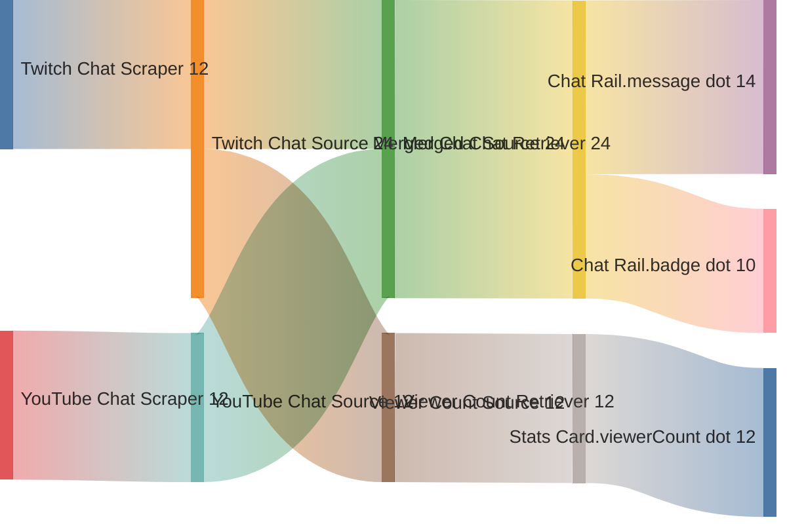

# NEXIS: the Product Requirements Document

## 1. Product overview

### 1.1 Document title and version

- NEXIS: the Product Requirements Document

- Version: 1.0.1

### 1.2 Product summary

NEXIS is a local-first stream enhancer with widgets and data. It is built on Bun, React, and TypeScript and is intended to give streamers a fast local control UI for configuring stream enhancements, previewing output, and delivering future render UIs for streaming software able to compose a web source.

Today the product provides a main admin UI and the first shared-state foundation for local experimentation. For almost all end users, the primary entrypoint should be the bundled executable rather than a Bun-driven developer workflow.

The longer-term direction is to turn the project into a packaged single executable that lets users define enhancement configurations, bind widgets to manual inputs and data flow resources, preview the result, publish consistent render UIs, synchronize updates locally, persist state safely, inspect change history when needed, and serve the local UI over HTTPS with automatically bootstrapped self-signed local TLS assets when none already exist.

### 1.3 First-pass domain model

- **Overlay**: A configuration of widget instances meant to be composed on top of a video stream. It is not a single isolated panel or one-off component. A representative overlay might combine a chat widget instance that merges Twitch and YouTube chat on the right side of the viewport, a now-listening widget instance that shows the current track title and artist at the bottom of the viewport, and a donation-goal widget instance that displays progress toward an Ulule campaign goal. The overlay configuration also carries the widget-instance-specific configuration and an overlay dependency list for the widgets used to create those instances.

- **Widget**: A reusable, importable, and exportable source object that proposes to the person creating or modifying an overlay a way to access visual elements or data in that overlay. A widget can hold reusable resources, styles, event reactions, and other reusable behavior that will be shared by the widget instances created from it. Widgets should support both full-configuration save or restore and data-flow-resource-only save or restore, with pipeline import or export using only the latter, and each serialized widget form should carry its own serialized format version string.

- **Widget resource**: A reusable resource exposed by a widget. Current examples include visual resources, sound resources, animated resources, and data flow resources. A resource may come from static code, local files, or another resource-specific storage shape, and each resource kind may define how it is saved when the widget is exported.

- **Data scraper**: A source-side ingestion component that collects data from a concrete upstream input, formats that collected data into events, and creates exactly one single-domain data source from those events. That data source should contain events from a single coherent event domain. Typical upstream inputs include local processing, watched file contents, commands, APIs, RSS or Atom feeds, and external event streams such as MQTT. A scraper should also be able to emit fake events that follow the same downstream event shape so users and developers can test data flows without waiting for live upstream activity.

- **Data retriever**: A selective aggregation component that subscribes to one or more data sources in a non-destructive way, always depends on at least one upstream data source, and always produces exactly one new downstream data source from the resulting derived event stream.

- **Data source**: A source of events created by a data scraper or a data retriever. A data source should represent a single coherent event domain. Data sources are the event-stream abstraction that downstream data retrievers and data flow resources can listen to.

- **Widget instance**: An overlay-scoped instantiation of a widget. A widget instance keeps a reference to its source widget and updates when that source widget changes. It holds only the configuration that is specific to its use in an overlay, such as opacity, placement, or instance-specific filtering or event-selection rules, and that configuration is saved inside the overlay configuration rather than as a standalone artifact.

- **Overlay dependency**: A widget dependency recorded by an overlay because one of its widget instances was created from that widget. Overlay import or activation should surface the overlay dependency list and still allow the user to continue when some referenced widgets are unavailable.

- **Data flow resource**: A widget-facing resource that listens to the events of a data source, extracts or transforms those events into values that can hydrate widget fields or other widget inputs, and provides that widget-usable data without creating a new data source. In the admin pipeline editor, only widget fields backed by data flow resources participate as dots.

- **Binding**: An element-owned derived configuration held on data retrievers, data flow resources, and widget-facing configuration rather than as a separate saved diagram object. Retriever configurations persist their own upstream-data-source binding identifiers, data flow resource configurations persist their own ingested-data-source binding identifiers, widget-side configuration persists its own referenced data-source identifiers, and pipeline import or export uses an archive of each element's own serialized format plus a lightweight manifest rather than inventing a separate whole-diagram binding schema.

- **Pipeline archive manifest**: A lightweight index file included in a whole-diagram pipeline configuration zip archive. In the first pass it should be stored as `manifest.json` at the root of that archive. It should declare `archiveFormatVersion`, `exportedAt`, `sourceAppVersion`, and one entry per participating exported element, where each entry includes `id`, `type`, `name`, archive-relative `file` path, `serializer`, serialized `formatVersion`, `dependencies`, and widget save or restore `mode` when relevant.

- **Serialized format version**: A version string carried by any importable or exportable artifact to describe the structure of its serialized data independently from the app version. Widgets, data scrapers, data retrievers, data flow resources, plugin-provided artifacts, and future importable or exportable artifact kinds should each expose one when they support save or restore or import or export. NEXIS should treat that value as an opaque compatibility label rather than assuming semantic versioning or monotonic ordering, and migration remains the responsibility of the artifact or plugin author rather than the core app.

- **Template**: The rendering or behavior definition a widget uses to turn its data into visible output or other widget behavior. In most cases, a renderable widget displays a template filled with current data.

- **Viewport placement**: The placement rules that determine where a renderable widget appears in the output viewport. Typical placements include a right-side chat rail, a bottom now-listening bar, or a floating donation-goal module.

- **Permission**: An explicit capability granted to a widget. Permissions may allow access to protected inputs or controlled actions, such as altering the current overlay or switching which overlay is displayed.

- **Overlay revision and publication state**: A distinction between in-progress, staged, and live overlay states. In the current direction, `/staging/:OVERLAY_ID` should expose the staged version of an overlay for validation, while `/render/:OVERLAY_ID` should expose the live version intended for actual use.

- **Credential or auth grant**: The stored authorization material that lets a data scraper or external-platform adapter access a user's upstream account or API on that user's behalf. It may represent OAuth2 tokens, API keys, or other provider-specific authorization artifacts, should be linkable and revocable from the UI, and should prefer OAuth2-style authorization when the upstream provider supports it.

## 2. Goals

### 2.1 Business goals

- Establish NEXIS as a dependable local-first control UI for stream-facing widgets and overlay workflows.

- Reduce the time required to tune stream-related content and preview it safely before use in render UIs.

- Create a reusable product foundation that supports admin tools and future render routes for streaming software able to compose a web source without parallel implementations.

- Support a packaged binary workflow that can run locally without a hosted backend dependency.

- Keep the product architecture testable and stable so future synchronization and persistence work can land without repeated rewrites.

### 2.2 User goals

- Configure stream enhancements without needing direct code edits.

- Bind widgets to relevant manual inputs and local or connected data flow resources, and preview the result before publishing.

- Publish a render-safe output that matches the operator-approved preview.

- Link upstream accounts securely when external data scrapers need user authorization.

- Recover safely from mistakes through undo, reset, and future persisted recovery.

- Run the tool locally with minimal setup and predictable behavior.

### 2.3 Non-goals

- Building a cloud-hosted multi-tenant product in the current iteration.

- Supporting branching history or destructive undo behavior.

- Finalizing the long-term backend API or transport contract before the product needs it.

- Delivering a broad visual redesign unrelated to operator workflows and product direction.

- Treating the current placeholder render-route implementation as the final render and staging experience.

## 3. User personas

### 3.1 Key user types

- Streamers

- Visual designers and technical producers

- Render consumers and users of streaming software able to compose a web source

- Local maintainers and integrators

### 3.2 Basic persona details

- **Streamers**: Need a fast local UI for assembling stream enhancements, configuring behavior, and validating output during setup or live preparation.

- **Visual designers and technical producers**: Need to preview widgets, typography, theme tokens, and UI states quickly while evaluating how the overlay feels in context.

- **Render consumers**: Need stable overlay-specific render routes that reflect the operator-approved projected state without exposing editing controls.

- **Local maintainers and integrators**: Need to launch, configure, package, and eventually persist the application safely on supported host machines.

- **Plugin developers**: Need a developer-oriented workflow such as `bun dev` while still targeting the same packaged-runtime behavior end users will rely on.

### 3.3 Role-based access

- **Streamers/Admins**: Can access admin-oriented UIs such as `/`, manage the current enhancement configuration, use undo and reset, and eventually inspect history or audit information.

- **Render viewers**: Can load render routes intended for viewing output only and should not be able to modify the underlying state.

- **Maintainers**: Can configure runtime behavior, ports, packaging, persistence, local bootstrap behavior, and credential or account-linking policies. They may also manage any future access configuration.

- **Plugin developers**: Can use development-oriented workflows, validate plugin behavior against the local app, and rely on the packaged runtime as the target user environment.

- **Guests**: Are not a primary current product role. If public or semi-public routes are introduced later, they should default to read-only behavior.

## 4. Functional requirements

- **Enhancement configuration management** (Priority: High)

  - Allow users to create, open, duplicate, reset, and eventually save local stream-enhancement configurations.

  - Keep a clear distinction between the currently edited configuration and any published render output.

  - Provide a safe default starting state for first-time usage.

  - Display the overlay dependency list for an overlay configuration.

  - When a user imports or activates an overlay configuration, present the overlay dependency list and allow the user to continue even if some referenced widgets are unavailable.

- **Packaged runtime bootstrap and local HTTPS** (Priority: High)

  - Treat the bundled executable as the primary launch path for end users, while keeping `bun dev` as a developer-oriented workflow for NEXIS maintainers and plugin authors.

  - Serve the local UI over HTTPS by default in the packaged runtime.

  - Detect whether local TLS assets already exist in the system folders used by the application.

  - If local TLS assets are missing, offer to generate them automatically by using whatever certificate-generation capability is available on the host platform.

  - Store generated local TLS assets in the system folders used by the application.

  - Warn clearly that any auto-generated local TLS certificate is self-signed, intended only for strictly local-machine use, and should not be used to expose the application on any network.

- **UI action ergonomics** (Priority: Medium)

  - Prefer clear icons over always-visible text labels for action buttons where the icon meaning remains understandable.

  - Provide a user preference that allows operators to keep labels visible alongside icons when they prefer a more textual UI.

  - When labels are hidden, require tooltips or equivalent accessible names so actions remain understandable and discoverable.

- **Widget composition and layout** (Priority: High)

  - Allow users to create, remove, enable, disable, and reorder widget instances or other overlay modules.

  - Treat an overlay as a composition of multiple widget instances arranged across the video viewport rather than as a single widget.

  - Treat widget instances as positionable overlay elements, while still allowing some widgets to remain non-renderable reusable sources for those instances.

  - Keep reusable widget configuration separate from widget-instance-specific overlay configuration.

  - Support configuring widget placement, grouping, and visibility rules for render UIs.

  - Support placements such as a right-side chat rail, a bottom now-listening bar, or a floating donation-goal module.

  - Reflect composition changes in preview before publication.

- **Widget library and portability** (Priority: Medium)

  - Allow users to configure widgets as reusable assets outside a specific overlay.

  - Allow users to export a widget as a zip package containing its configuration and whatever save format each widget resource exposes.

  - Allow users to import a widget package so it becomes available in the admin interface for future widget instances.

  - Keep the widget concept extensible so new resource kinds can be introduced in code without redefining the import and export workflow.

- **Data pipelines and input mapping** (Priority: High)

  - Allow data scrapers to collect and format events from local processing, watched file contents, commands, APIs, RSS or Atom feeds, and external event streams such as MQTT, and create exactly one single-domain data source from those events.

  - Keep the data source created by a data scraper scoped to a single coherent event domain, such as chat-message events or follow-notification events rather than a mixed upstream bundle.

  - Let data scrapers expose fake-event generation so users and developers can test data flows, widgets, and retrievers without waiting for real upstream events or consuming API credits.

  - Use stable persisted identifiers and faithful names for diagram-addressable scrapers, data sources, data retrievers, data flow resources, widgets, and widget instances.

  - Allow data retrievers to subscribe to one or more data sources in a non-destructive way, require at least one upstream data source per retriever, and produce exactly one new downstream data source per retriever.

  - Provide an admin-UI pipeline editor where data scrapers are the origins of flows, data retrievers are nodes that can sit on one flow or across multiple flows, and retrievers always create one new downstream flow without consuming the upstream ones.

  - Use that pipeline editor as the primary configuration UI for event-driven widget hydration, while keeping the persisted shared configuration on the underlying data scrapers, data retrievers, data flow resources, widgets, and widget instances rather than in a separately saved diagram artifact.

  - Compute retriever-node positions dynamically from the data sources they depend on and the next downstream dependency or end of the diagram, with a default midpoint placement between those dependency boundaries rather than persisting retriever positions as part of retriever configuration.

  - Allow operators to enable or disable data scrapers from that pipeline editor.

  - Allow operators to trigger scraper-provided fake events from the UI, with those events flowing through the same downstream pipeline paths as live events.

  - Allow operators to route upstream flows into retriever nodes and create, update, or delete retrievers through node-driven modal dialogs.

  - Allow import and export of individual retriever configurations using each retriever's own serialized format.

  - Allow data flow resources to listen to data source events, extract or transform those events into widget-usable values, and provide those values without creating new data sources.

  - Allow operators to browse and search the current widget-instance list below the diagram, showing only widget instances that expose at least one data flow resource field and representing each such field as a dot.

  - Allow those widget-field dots to be placed directly on the relevant flows so operators can configure bindings that determine which field is hydrated from which data source, with the resulting binding identifiers persisted on the owning data flow resources rather than as separate connection objects.

  - Allow operators to enable or disable retrievers, propagate disabled state to downstream retrievers, grey out affected flows and nodes, and show red warning indicators on affected widget-field dots when disabled upstream flows break those bindings.

  - Allow import and export of whole-diagram pipeline configurations as a zip archive containing a lightweight manifest plus the serialized import or export formats used by the participating data scrapers, data retrievers, data flow resources, and widgets.

  - Use a `manifest.json` file at the root of that zip archive that declares `archiveFormatVersion`, `exportedAt`, `sourceAppVersion`, and one entry per participating exported element with `id`, `type`, `name`, archive-relative `file` path, `serializer`, serialized `formatVersion`, `dependencies`, and widget save or restore `mode` when relevant.

  - Let each participating element keep its own serialized import or export format and its own serialized format version string, and use archive composition rather than inventing a separate whole-diagram binding schema.

  - Require any importable or exportable artifact, including plugin-provided artifacts, to carry its own serialized format version string so structural compatibility checks can be delegated to the relevant artifact or plugin author when data structures evolve.

  - Require widgets to support both full-configuration save or restore and data-flow-resource-only save or restore, with the pipeline editor using only the data-flow-resource-only mode.

  - Allow widgets to consume manual inputs and local or connected data flow resources.

  - Let users link upstream accounts or credentials to data scrapers through the UI, with clear explanations of requested permissions and the resulting access.

  - Prefer OAuth2-style account-linking flows when the upstream provider supports them.

  - Let users revoke linked accounts or credentials from the UI.

  - Store linked-account credentials and grants securely in the system folders used by the application and warn users that those credentials are sensitive.

  - Make data scraper, data retriever, data source, and data flow resource support available as early as possible in the implementation phase because multiple widget behaviors depend on them.

  - Support template-oriented widgets that render processed data rather than only static content.

  - Support mapping data from data flow resources into widget properties without requiring direct code edits.

  - Support widgets driven by multi-source and service-specific data flow resources, such as merged Twitch and YouTube chat, music metadata, and Ulule campaign progress.

  - Support in-house processed event pipelines such as simple mathematical operations, watched file contents, and command results.

  - Support external event pipelines such as third-party APIs, chats, subscriptions, RSS and Atom feeds, and MQTT-like servers.

  - Handle missing, stale, or invalid data gracefully.

- **Preview and visual sandboxing** (Priority: High)

  - Provide a live preview UI that mirrors the current enhancement state.

  - Keep visual sandboxing subordinate to product requirements rather than letting cosmetic experiments define the product scope.

  - Allow users to validate visual polish, typography, and layout before publishing.

- **Render delivery** (Priority: High)

  - Give each overlay its own live route at `/render/:OVERLAY_ID`.

  - Give each overlay its own staging route for validation at `/staging/:OVERLAY_ID`.

  - Drive both route families from the shared projected state rather than from isolated implementations.

  - Keep render routes optimized for streaming software able to compose a web source.

  - Keep the staging route separate from the live route so operators can validate in-progress overlay changes without replacing the live output immediately.

- **State history, undo, and audit** (Priority: High)

  - Represent accepted changes as append-only history entries.

  - Support undo through compensating entries rather than destructive rewrites.

  - Treat changes to data scrapers, data retrievers, data flow resources, and their dependencies as history-tracked edits whose propagated downstream effects are also reverted when the originating change is undone.

  - Provide enough structured history to support a future audit UI and troubleshooting workflow.

- **Widget permissions and control behavior** (Priority: Medium)

  - Allow specific widgets to be granted permission to alter the current overlay state or switch which overlay is currently displayed.

  - Keep widget permissions explicit, auditable, and revocable.

  - Prevent unprivileged widgets from mutating overlay selection or other protected global behavior.

- **Persistence and recovery** (Priority: Medium)

  - Persist accepted configurations and history locally through SQLite or an equivalent storage layer.

  - Rehydrate projected state from stored history on startup.

  - Fail safely if persisted data is missing, outdated, or partially invalid.

- **Real-time synchronization** (Priority: Medium)

  - Propagate accepted admin changes to render UIs in real time.

  - Keep admin, preview, and render projections consistent.

  - Recover cleanly from temporary synchronization interruptions.

- **Access control and runtime administration** (Priority: Medium)

  - Support clear access boundaries between admin-editing routes and render-only routes.

  - Introduce secure admin access if access restrictions are enabled.

  - Preserve a friction-light local workflow when access restrictions are disabled.

- **Packaged local runtime** (Priority: Medium)

  - Run through the development watcher and host-platform compiled binaries.

  - Respect local configuration and `PORT` override behavior.

  - Bootstrap required local runtime assets, config, and database dependencies predictably.

## 5. User experience

### 5.1. Entry points & first-time user flow

- End users start the app primarily through the bundled executable and arrive at the admin UI.

- NEXIS maintainers and plugin developers may also use `bun dev`, but that workflow should not be treated as the primary first-time-user path.

- First-time users are guided toward a starter enhancement configuration rather than raw technical controls.

- If no local TLS key and certificate are available, the app offers automatic generation before serving the UI and explains that the generated certificates are self-signed and only suitable for strictly local-machine use.

- The main admin UI is the primary operator-facing product UI.

- When external data scrapers need account access, the UI should guide users through linking those accounts with clear permission explanations and revocation paths.

- Users define or open the current enhancement configuration, connect or enter the data it needs, and preview the result.

- Users can open `/staging/:OVERLAY_ID` to validate in-progress overlay changes and `/render/:OVERLAY_ID` to inspect the live output.

- Users discover reset, undo, and future save/load affordances early so experimentation feels safe.

### 5.2. Core experience

- **Launch the app**: Operators start the local app and open the browser UI.

  - Startup should be predictable and should clearly expose the available product UIs.

- **Create or open an enhancement configuration**: Operators begin from a saved setup, a starter preset, or a new blank state.

  - The first working UI should feel approachable and should not require code knowledge to begin.

- **Configure widgets and data mappings**: Operators choose reusable widgets, create widget instances from them, define how those instances are arranged, and decide which manual inputs or data flow resources drive those widget instances.

  - Configuration changes should be understandable, reversible, and safely validated before publication.

  - Event-pipeline configuration should remain legible through a visual flow editor where scrapers originate flows, retrievers derive new flows, and widget-field dots expose field hydration points.

  - When upstream activity is unavailable, scraper-provided fake events should make pipeline and widget behavior testable from the same UI.

- **Preview and refine presentation**: Operators use preview and sandbox UIs to validate visual polish, layout, and readability.

  - Visual feedback should feel immediate, stable, and clearly connected to the current enhancement configuration.

- **Publish to render UIs**: Operators open or embed overlay-specific staging and live routes that consume the approved shared state.

  - Render views should remain lightweight, read-only, and suitable for streaming software able to compose a web source.

- **Recover, save, and inspect changes**: Operators undo, reset, save, reload, or inspect history as needed.

  - Recovery and persistence flows should make experimentation safe instead of risky.

### 5.3. Advanced features & edge cases

- Missing or stale data should fall back gracefully rather than breaking the preview or render output.

- Non-renderable widget instances should remain configurable and visible in the overlay list even when they do not draw directly into the viewport.

- Widgets that can alter overlay state or active-overlay selection should be permission-gated and auditable.

- Widget configurations should validate before publication.

- Widgets backed by local or external event pipelines should fail safely when their data scrapers, data retrievers, data sources, or data flow resources are unavailable or malformed.

- Account-linking flows should explain requested permissions clearly and allow revocation without forcing users into manual secret-file management.

- Importing or activating an overlay should surface missing widgets from the overlay dependency list clearly and still allow the user to continue when partial recovery is acceptable.

- Widget export should include the saveable output exposed by each widget resource rather than assuming one universal storage format.

- No-op updates should not create meaningless history entries.

- Undo should remain correct across multi-step edits and reset events.

- Render routes should degrade gracefully if synchronization is temporarily unavailable.

- Local startup should still communicate clear errors when config or database bootstrap fails.

- Port overrides should work when the default port is unavailable or already in use.

- Access restrictions should protect editing UIs without breaking render-only usage.

### 5.4. UI/UX highlights

- Dark-first control-room aesthetic that favors focused operator workflows.

- Preview-first workflow that keeps user intent visible while editing.

- Action-heavy UIs should prefer recognizable icons, while still allowing users to keep visible labels or rely on tooltips.

- Clear separation between editing UIs, visual sandbox UIs, and render-only UIs.

- Flexible widget and data composition matters more than any one sandbox layout.

- A dynamic Sankey or alluvial-style pipeline editor can make scrapers, multi-source data-retriever subscriptions, derived downstream data sources, and widget-field hydration dots legible in the admin UI.

### 5.5. Example Sankey-style admin UI sketch

The following fake Mermaid example illustrates the intended shape of the data-flows admin UI, with scraper-created flows, retriever nodes, and widget-field dots fed by derived data sources.

- Widget-instance stickers or cards below the diagram can keep data-flow-resource dots visually grouped by widget ownership and reduce placement ambiguity.

- Disabled flows and retriever nodes should grey out clearly, while affected widget-field dots should carry explicit warning signals.

- Accessible semi-random colors that remain stable per user can improve flow recognition without turning color choice into a primary operator task.

- Fast feedback for changes, validation, and recovery actions reduces ambiguity.

- Reset and undo affordances reduce fear of experimentation.

## 6. Narrative

A streamer wants to assemble an on-brand set of stream enhancements before going live because the show context, upstream event data, and visual priorities change from session to session. They open NEXIS locally, start from a reusable configuration, link any needed upstream accounts, configure widgets and data mappings, test flows with fake events when live activity is unavailable, refine the presentation in preview and staging, and publish a render-safe live output for streaming software able to compose a web source. The tool works for them because it keeps composition, account linking, preview, staged validation, recovery, and future synchronization in one local workflow instead of scattering those steps across ad hoc edits in streaming software able to compose a web source.

## 7. Success metrics

### 7.1. User-centric metrics

- At least 90% of first-time operators can create or open an enhancement configuration and produce a first working preview within 5 minutes of launch.

- At least 95% of accepted edits are reflected in the preview in under 1 second on target local hardware.

- At least 80% of recovery attempts using undo or reset complete without requiring a manual refresh.

- Operators can reliably distinguish editing routes, sandbox routes, and render-only routes during validation sessions.

### 7.2. Business metrics

- Reduce the time needed to assemble a usable stream enhancement layout by at least 50% compared with manually editing isolated values in streaming software able to compose a web source.

- Reach a stable packaged-binary workflow across supported local development targets.

- Reuse one shared product model across admin, sandbox, and render flows rather than maintaining parallel state implementations.

- Lower regression risk for core operator workflows through shared-state coverage and documented product requirements.

### 7.3. Technical metrics

- At least 95% of replayed state histories reconstruct projected state without divergence from expected outcomes.

- Target local render synchronization latency below 250 ms once real-time propagation is implemented.

- Keep packaged startup under 5 seconds on target hardware after binary launch.

- Keep projected-state replay within 500 ms for expected near-term session histories before optimization work is required.

## 8. Technical considerations

### 8.1. Integration points

- Bun server for local routing, runtime behavior, and future synchronization endpoints.

- Wouter-based client routes for admin, staging, and render UIs.

- Future SQLite persistence for accepted history and startup rehydration.

- Future WebSocket or similar push-based synchronization for admin-to-render propagation.

- Future external platform adapters for Discord, Twitch, YouTube, PeerTube, ActivityPub, TikTok, PayPal, and Tipeee or TipeeeStream.

- Direct D3.js integration for a future admin pipeline visualization or configuration view, without a wrapper layer between React and D3.

- Consumption of `/render/:OVERLAY_ID` routes by streaming software able to compose a web source.

- Consumption of `/staging/:OVERLAY_ID` routes for operator-side validation before going live.

- Local configuration files, TLS assets, and packaged binary bootstrap behavior.

- Platform-specific local certificate-generation capabilities or equivalent fallback commands for automatic self-signed HTTPS bootstrap.

### 8.2. Data storage & privacy

- Store operator-facing configuration and accepted history locally by default.

- Store generated local TLS key and certificate assets in the system folders used by the application.

- Store linked-account credentials, OAuth2 tokens, and other auth grants securely in the system folders used by the application.

- Persist only the minimum required configuration state, history, and audit context necessary for product behavior.

- Keep pipeline-editor layout derived from shared element configuration, while allowing local browser storage to retain per-user visual preferences such as stable accessible color assignments or constrained layout nudges.

- Avoid external data transmission by default in the local-first model.

- Treat admin and render routes as distinct access UIs when access restrictions are enabled.

- Plan for redaction or omission of sensitive values from future audit or persisted history views if needed.

- Warn clearly that automatically generated TLS certificates are self-signed and intended only for strictly local-machine use, not for serving the application on any network.

- Warn clearly that linked-account credentials are sensitive and should not be shared outside the local machine context.

### 8.3. Scalability & performance

- Keep edit-to-preview latency low on local hardware.

- Add snapshotting or replay optimization as history grows.

- Use selector-driven reads to avoid unnecessary rerenders of unrelated UI.

- Keep render routes lightweight and stable for streaming software able to compose a web source.

- Maintain acceptable binary build, startup, and restart behavior during local development and packaged usage.

### 8.4. Potential challenges

- Designing the synchronization contract without overcoupling the product to one transport shape.

- Keeping admin and render projections fully consistent as more UIs are added.

- Handling certificate generation and storage safely across supported host platforms without requiring manual cryptographic setup from end users.

- Handling OAuth2 and other provider-auth flows securely while keeping account linking understandable for non-technical users.

- Managing SQLite persistence, migration, and rehydration without destabilizing the local-first model.

- Adding access control without hurting local simplicity or operator speed.

- Handling HTTPS, certificate, and runtime quirks across host platforms.

### 8.5. Architecture direction

- Use hexagonal architecture principles so the domain and application core stay independent from frameworks, transports, and provider APIs and SDKs.

- Keep domain and application logic free of direct dependencies on React, Bun HTTP, WebSocket, SQLite, filesystem watchers, MQTT clients, or provider-specific APIs and SDKs.

- Define ports in the core-facing layers for persistence, synchronization, runtime services, and external event ingestion.

- Avoid provider-specific ports in the core. External platform integrations should use a shared plugin contract plus a small set of capability-oriented ports.

- The shared plugin contract should declare plugin identity, configuration, lifecycle, and which capability-oriented ports the plugin supports so new external platform adapters can be added as plugins without changing the core.

- If a plugin exposes importable or exportable artifacts, the shared plugin contract should also declare their serializers and serialized format version strings so NEXIS can identify compatibility and hand migration responsibility to the plugin author for plugin-provided data.

- The first capability-oriented ports should cover at least chat events, subscription events, payment events, and social activity events.

- Capability-oriented ports should emit normalized event shapes built on the normalized capability event envelope.

- The normalized event and actor/chat schema guidance below is intentionally concern-level for now, so exact first-class field names can follow real adapter constraints instead of being frozen prematurely.

- The normalized capability event envelope should cover concerns around stable event identity, capability kind, provider and plugin provenance, occurrence and observation timing, and a normalized `sourceContext` reference describing where the event happened.

- The initial chat events shape should cover concerns around an observed actor account, message payload, a `sourceContext` field carrying normalized chat source context, message kind, reply linkage, and moderation or visibility state where relevant.

- The normalized actor account reference should cover concerns around provider-account-scoped identification, provider-native identification, actor kind, presentation-oriented account fields, role or verification signals when relevant, and an optional canonical actor identity link.

- The canonical actor identity reference should cover concerns around stable NEXIS identity identification, identity kind, presentation fields, and the ability to aggregate multiple provider accounts without collapsing the observed account carried by the event.

- The normalized chat source context should cover concerns around stable chat-context identification, context kind, required room-level context, and optional higher-level space, thread, stream, or owner context.

- Observed actors in normalized capability events should remain provider-account-scoped, while cross-provider matching should happen through canonical actor identity references rather than by merging observed accounts into one event actor record.

- The initial subscription events shape should cover the observed actor account, support kind, tier or level information, tenure or streak information, gifting context when relevant, and an optional support message or note.

- The initial payment events shape should cover the observed actor account when available, payment kind, amount and currency, transaction state, an optional note, and any relevant target or transaction references.

- The initial social activity events shape should cover the observed actor account, activity kind, object or target reference, content summary or payload, audience or visibility context, and related actor accounts where relevant.

- Implement adapters in presentation and infrastructure layers rather than letting those technologies define the core model.

- Treat admin and render UIs as presentation adapters around the same core model.

- Treat Discord, Twitch, YouTube, PeerTube, ActivityPub, TikTok, PayPal, and Tipeee or TipeeeStream as external platform adapters around the core rather than as domain-defining concepts.

- Let external platform adapters feed data scrapers or adjacent ingestion paths that create single-domain data sources, which data retrievers can then turn into additional data sources before data flow resources expose widget-usable data.

- Let new external platform adapters be added by implementing the shared plugin contract and any relevant capability-oriented ports, rather than requiring new provider-named ports in the core.

## 9. Milestones & sequencing

### 9.1. Project estimate

- Large: 8-16 weeks from the current foundation to reach a persistence-backed, render-synchronized, packaged operator-ready milestone.

### 9.2. Team size & composition

- Medium Team: 3-5 total people

  - Product manager, 2-3 engineers, 1 designer, and part-time QA support

### 9.3. Suggested phases

- **Phase 1**: Expand shared-state UIs beyond the current sandbox and foundation work (2-3 weeks)

  - Key deliverables: data scraper, data retriever, data source, and data flow resource foundations, projected live and staging overlay routes, improved admin shell behavior, additional selector-driven integrations

- **Phase 2**: Add history and audit product UIs (1-2 weeks)

  - Key deliverables: operator-visible history view, accepted command and event display, undo context in the UI

- **Phase 3**: Implement real-time synchronization between admin and render UIs (2-3 weeks)

  - Key deliverables: transport contract, push-based updates, render consistency checks

- **Phase 4**: Add SQLite persistence and startup rehydration (2-4 weeks)

  - Key deliverables: stored history, local database bootstrap, replay on startup, failure handling

- **Phase 5**: Harden packaged runtime and access boundaries (1-2 weeks)

  - Key deliverables: config bootstrap, admin-vs-render access protection, startup and recovery polish

## 10. User stories

### 10.1. Launch the admin UI

- **ID**: US-001

- **Description**: As a streamer, I want to open the local admin UI so that I can manage my stream enhancement setup from one place.

- **Acceptance criteria**:

  - The local app exposes a browser-accessible admin route after startup.

  - The admin UI loads without requiring a hosted backend.

  - A usable starting configuration or entry point is visible when the UI opens.

  - The route works in both development and packaged runtime flows.

### 10.2. Create or open an enhancement configuration

- **ID**: US-002

- **Description**: As a streamer, I want to create or open an enhancement configuration so that I can work on a reusable stream setup instead of starting from scratch every time.

- **Acceptance criteria**:

  - I can start from a new configuration, a starter preset, or a previously saved setup.

  - The app clearly shows which configuration is currently being edited.

  - Opening a configuration restores its editable state.

  - Resetting to a safe baseline is available when needed.

### 10.3. Add and configure widgets

- **ID**: US-003

- **Description**: As a streamer, I want to add and configure widgets so that I can assemble the enhancement experience I need for a specific show or scene.

- **Acceptance criteria**:

  - I can create widget instances from widgets that are available in the admin interface.

  - I can configure reusable widget settings separately from widget-instance-specific overlay settings.

  - I can configure renderable widget instances and also keep non-renderable widgets available as reusable sources when they serve a supporting role.

  - I can edit the main settings for reusable widgets and widget instances without direct code changes.

  - Invalid widget configurations are rejected or surfaced clearly.

  - Widget changes update the current working state immediately.

### 10.4. Arrange widget layout and visibility

- **ID**: US-004

- **Description**: As a streamer, I want to arrange widget layout and visibility so that the rendered output matches the intended composition.

- **Acceptance criteria**:

  - I can reorder widget instances or modules within the current configuration.

  - I can enable, disable, or hide widget instances without deleting them.

  - Layout and visibility changes are reflected in preview before publication.

  - The resulting composition remains stable across refresh or reload after persistence is implemented.

### 10.5. Provide manual inputs or event-driven widget data

- **ID**: US-005

- **Description**: As a streamer, I want widgets to consume manual inputs or data flow resources built from event streams so that the enhancement output can reflect the current context.

- **Acceptance criteria**:

  - I can supply manual input for widgets when no live data flow resource is connected.

  - Data scrapers can collect and format events from local processing, watched file contents, commands, APIs, RSS or Atom feeds, or external event streams such as MQTT, and create exactly one single-domain data source from those events.

  - The data source created by a scraper contains events from a single coherent event domain, such as chat-message events or follow-notification events.

  - Data scrapers can expose fake-event generation so I can test data flows and widgets without waiting for real upstream events or consuming API credits.

  - Data retrievers can subscribe to one or more data sources in a non-destructive way, always depend on at least one upstream data source, and always produce exactly one new downstream data source.

  - I can enable or disable data scrapers from the visual flow editor.

  - I can trigger scraper-provided fake events from the UI and see them travel through the same downstream flow as live events.

  - I can add data retrievers that sit on one flow or across multiple flows and route upstream flows into them.

  - Data-retriever node placement is calculated dynamically from its current upstream and downstream dependencies, with a default midpoint placement between those dependency boundaries rather than being saved on the retriever itself.

  - Clicking a retriever node opens a modal dialog where I can create, edit, or delete that retriever.

  - I can import or export an individual retriever configuration using that retriever's own serialized format.

  - The visual flow editor is the primary UI for configuring event-driven widget hydration, even though the visible diagram is derived from persisted element configurations rather than stored separately.

  - I can inspect and configure data sources and data retrievers through a visual flow editor in the admin UI, where retrievers create new downstream flows without consuming the upstream ones.

  - Data flow resources can listen to data source events, extract or transform those events into widget-usable values, and provide those values to widgets.

  - Only widget fields backed by data flow resources participate in the visual flow editor.

  - I can browse and search the current widget-instance list below the diagram, showing only widget instances that expose at least one data flow resource field and representing each such field as a dot.

  - I can place widget-field dots directly on the relevant flows so I can configure bindings that determine which field is hydrated from which data source, and the represented data flow resource then ingests events from that flow with the binding identifier persisted on that resource rather than as a separate connection object.

  - Disabling a retriever disables the downstream retrievers that depend on it, greys out the affected flows and nodes, and places red warning indicators on affected widget-field dots.

  - I can import or export a whole-diagram pipeline configuration as a zip archive of the participating elements' own serialized formats plus a lightweight manifest.

  - The archive manifest is stored as `manifest.json` at the root of that zip archive and includes `archiveFormatVersion`, `exportedAt`, `sourceAppVersion`, and one entry per participating exported element with `id`, `type`, `name`, archive-relative `file` path, `serializer`, serialized `formatVersion`, `dependencies`, and widget save or restore `mode` when relevant.

  - Each importable or exportable artifact involved in that archive carries its own serialized format version string, including plugin-provided artifacts when they participate.

  - I can link upstream accounts or credentials to data scrapers from the UI with clear permission explanations, and revoke those links later.

  - OAuth2-style account-linking is used when the upstream provider supports it.

  - When pipeline import or export involves widgets, the diagram-side operation uses only the widgets' data-flow-resource-only save or restore mode rather than their full-configuration save or restore mode.

  - The system can map widget properties to local or connected data flow resources.

  - Undoing a pipeline-configuration change also reverts the downstream enable or disable effects that change triggered.

  - Missing, stale, or invalid upstream event data does not crash the preview or render output.

  - Widgets surface a predictable fallback state when valid upstream event data is unavailable.

### 10.6. Preview the current enhancement state live

- **ID**: US-006

- **Description**: As a streamer, I want a live preview of the current enhancement state so that I can validate the result before publishing it to render UIs.

- **Acceptance criteria**:

  - Accepted configuration changes appear in preview without manual refresh.

  - Preview behavior stays consistent with the currently edited configuration.

  - Preview remains visible while I continue editing.

  - Preview rendering stays stable when multiple fields or widgets change in sequence.

### 10.7. Use the admin UI as a visual sandbox

- **ID**: US-007

- **Description**: As a designer or technical producer, I want the main admin UI to support visual sandboxing so that I can refine cosmetics and interaction polish without confusing that work with final product requirements.

- **Acceptance criteria**:

  - The main admin UI supports visual experimentation without becoming a separate product definition.

  - The sandbox can be used to validate layout, theme, and interaction polish.

  - Cosmetic experiments do not redefine the canonical product scope by themselves.

  - The sandbox remains useful without becoming the only supported workflow.

### 10.8. Publish to a render UI

- **ID**: US-008

- **Description**: As a render consumer, I want `/render/:OVERLAY_ID` to reflect the live approved state of a specific overlay, and `/staging/:OVERLAY_ID` to reflect its staged in-progress state, so that live output stays stable while validation remains separate.

- **Acceptance criteria**:

  - `/render/:OVERLAY_ID` renders the live projected state for that overlay instead of a placeholder page.

  - `/staging/:OVERLAY_ID` renders the staged projected state for that overlay instead of sharing the live route output.

  - Render routes remain read-only from the perspective of editing workflows.

  - Changes promoted to the live revision appear in the render UI, while staged-only changes appear in the staging UI until they are promoted.

  - Render behavior remains stable when different overlay IDs are requested or when a staging revision is missing.

### 10.9. Undo or reset recent changes

- **ID**: US-009

- **Description**: As a streamer, I want to undo or reset changes so that I can recover quickly from mistakes while editing the current enhancement setup.

- **Acceptance criteria**:

  - Undo appends a compensating history entry instead of mutating existing history.

  - Reset returns the configuration to a safe baseline when requested.

  - No-op recovery actions do not create meaningless history entries.

  - Recovery actions are clearly available and trustworthy in the UI.

### 10.10. Save and restore local state

- **ID**: US-010

- **Description**: As a streamer, I want my enhancement setup to survive restarts so that I do not lose work between sessions.

- **Acceptance criteria**:

  - Accepted configuration history can be persisted locally.

  - The app can restore projected state from persisted history on startup.

  - Rehydrated state matches the last successfully saved state.

  - Corrupt or unavailable persisted data fails safely without crashing the whole app.

### 10.11. Inspect history and audit context

- **ID**: US-011

- **Description**: As a streamer, I want to inspect accepted commands and events so that I can understand what changed and recover with confidence.

- **Acceptance criteria**:

  - The UI exposes a history or audit UI for accepted entries.

  - Each entry shows when it happened and which command suite produced which event.

  - Undo-related entries are distinguishable from ordinary changes.

  - The history view reflects the same append-only model used for replay.

### 10.12. Synchronize admin changes to render UIs in real time

- **ID**: US-012

- **Description**: As a streamer, I want accepted changes to propagate to render UIs in real time so that live output stays in sync with the control UI.

- **Acceptance criteria**:

  - Accepted admin changes are pushed to connected render UIs without manual refresh.

  - Render UIs apply updates in order and remain consistent with the current projected state.

  - Temporary transport interruptions recover without duplicating or losing accepted changes.

  - The domain model remains usable even if the final transport protocol changes later.

### 10.13. Handle missing or invalid data gracefully

- **ID**: US-013

- **Description**: As a streamer, I want missing or invalid data to fail gracefully so that the product stays usable during imperfect runtime conditions.

- **Acceptance criteria**:

  - Missing or stale data produces a fallback state instead of a broken UI.

  - Invalid data mappings are surfaced clearly to the user.

  - The projected state remains deterministic after ignored or invalid inputs.

  - Render output continues operating in a degraded but understandable state where possible.

### 10.14. Protect admin access while preserving render access

- **ID**: US-014

- **Description**: As a maintainer, I want admin-editing routes to be protected when access restrictions are enabled so that control UIs are not modified by unauthorized viewers.

- **Acceptance criteria**:

  - The product can distinguish admin-editing UIs from render-only UIs.

  - When access protection is enabled, unauthorized users cannot change admin state.

  - Render-only consumers can still access the UIs intended for viewing.

  - Authentication or access controls do not block local operator workflows when explicitly disabled.

### 10.15. Link external accounts to data scrapers securely

- **ID**: US-015

- **Description**: As a streamer, I want to link and revoke upstream accounts from the UI so that data scrapers can work without forcing me to manage secrets manually.

- **Acceptance criteria**:

  - The UI can start an account-linking flow for a scraper that requires upstream authorization.

  - The UI explains what account access and permissions are being requested before the user approves the link.

  - OAuth2-style authorization is used when the upstream provider supports it.

  - The resulting credentials or auth grants are stored securely in the system folders used by the application.

  - The user can revoke or disconnect a previously linked account from the UI.

### 10.16. Choose icon-first or label-visible action controls

- **ID**: US-016

- **Description**: As an operator, I want action-heavy controls to be icon-first by default while still allowing visible labels when I prefer them, so that the UI can stay efficient without becoming unclear.

- **Acceptance criteria**:

  - Action-heavy buttons and controls prefer recognizable icons by default.

  - I can enable a setting that keeps labels visible alongside those icons.

  - When labels are hidden, the controls still expose tooltips or equivalent accessible names.

  - The icon-first presentation does not remove clarity for destructive or high-risk actions.

### 10.15. Launch the packaged runtime with local bootstrap behavior

- **ID**: US-015

- **Description**: As a streamer, maintainer, or plugin developer, I want the packaged application to initialize its config, local TLS assets, and local database cleanly so that end users can run it without manual setup steps and developers can still target the same runtime behavior.

- **Acceptance criteria**:

  - The packaged binary starts on supported host platforms.

  - The bundled executable is the primary supported launch path for end users.

  - Development workflows such as `bun dev` remain available for NEXIS maintainers and plugin developers without redefining the end-user entrypoint.

  - Required config and database files are created or discovered automatically.

  - If local TLS assets are missing, the app offers to generate a self-signed local TLS certificate and matching key automatically by using whatever certificate-generation capability is available on the host platform.

  - Generated TLS assets are stored in the system folders used by the application.

  - The app warns clearly that any generated local TLS certificate is self-signed and suitable only for strictly local-machine use, not for serving the application on any network.

  - The local UI is served over HTTPS once valid local TLS assets are available.

  - Startup failures surface actionable errors instead of silent exits.

  - Runtime behavior remains consistent with the development experience where applicable.

### 10.16. Allow privileged widgets to alter overlay behavior

- **ID**: US-016

- **Description**: As a streamer or maintainer, I want specific widgets to be able to alter the current overlay or switch which overlay is displayed so that overlay behavior can react to runtime conditions without giving every widget global control.

- **Acceptance criteria**:

  - Widget capabilities that can alter overlay behavior are explicitly permission-gated.

  - Authorized widgets can request changes to the current overlay or the displayed overlay.

  - Unauthorized widgets cannot mutate protected overlay-selection behavior.

  - Widget-triggered overlay changes are auditable through the same history model used for other accepted changes.

### 10.17. Import or export a widget

- **ID**: US-017

- **Description**: As a streamer or designer, I want to export a configured widget and import it later so that I can reuse it across overlays or share it outside the application.

- **Acceptance criteria**:

  - I can export a widget as a zip package.

  - The export includes the widget configuration and whatever saveable output each widget resource exposes.

  - I can import a compatible widget package through the admin interface.

  - An imported widget becomes available for creating new widget instances.

### 10.18. Import or activate an overlay when some required widgets are unavailable

- **ID**: US-018

- **Description**: As a streamer, I want to see the overlay dependency list for an overlay before importing or activating it so that I can understand what is missing and still choose whether to continue.

- **Acceptance criteria**:

  - The overlay configuration shows its overlay dependency list.

  - Importing or activating an overlay presents the overlay dependency list before proceeding.

  - Missing widgets from that list are clearly identified.

  - I can continue importing or activating the overlay even when some widgets are unavailable.

