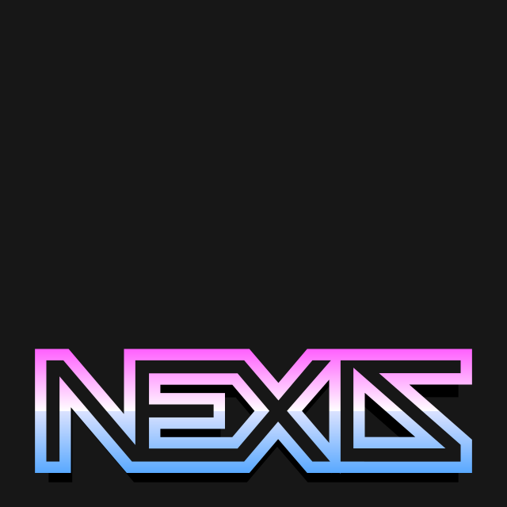
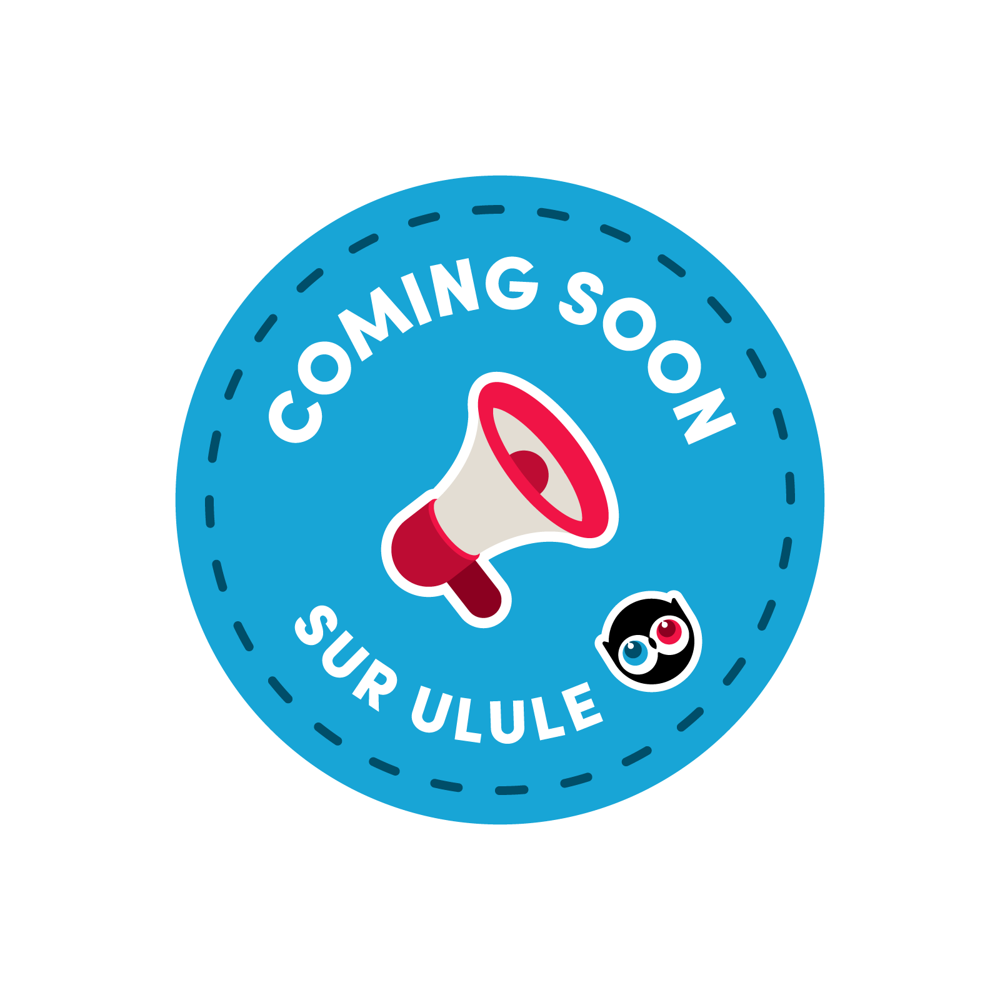

# 

Local-first stream enhancement studio for creators who want more control without a cloud dashboard.

NEXIS is built for streamers who want to shape their overlays, connect real-time event sources, preview changes safely, and keep full control on their own machine.

The long-term goal is straightforward: let you assemble reusable widgets, route live event data into them, validate everything locally, and publish staged or live overlay outputs without turning your workflow into a pile of fragile manual steps.

## Why NEXIS

- Local-first workflow with the application and its data under your control
- Stream-focused overlays, widgets, and data pipelines instead of generic dashboard tooling
- Staging and live output directions designed to keep experimentation separate from what is actually on stream
- Future-friendly plugin model for new widgets, data scrapers, and integrations

## Who It Is For

- Streamers who want more control over overlays and live data
- Technical creators who want reusable widget and pipeline building blocks
- Designers and producers who want to preview and refine stream presentation locally

## What To Expect

- A main admin UI for configuring the project locally
- A product direction focused on widgets, overlays, data scrapers, retrievers, preview, staging, and live output
- A packaged executable as the primary end-user entrypoint
- Early-stage product status while the full overlay, staging, render, and data-flow workflow is still being built

## Getting NEXIS

Most users should use the bundled executable release rather than the Bun developer workflow.

The latest packaged release is available here:

- https://github.com/kane-thornwyrd/nexis/releases/latest

## Current Product Direction

- Admin UI for local configuration and future onboarding flows
- Preview, staging, and live overlay output as the main publishing direction
- Data-driven widgets powered by scrapers, retrievers, and data flow resources
- Secure local-first runtime behavior, including local HTTPS bootstrap and future account-linking flows

## Current Status

- The product direction is now much clearer than the current implementation surface
- The admin UI is still early and the full overlay workflow is not finished yet
- Persistence, real-time sync, and final live/staging overlay routes are still in progress

## Project Docs

- [PRD.md](./PRD.md) for the product requirements and roadmap direction
- [GLOSSARY.md](./GLOSSARY.md) for the current domain vocabulary
- [CHANGELOG.md](./CHANGELOG.md) for significant project changes
- [DEVELOPER_README.md](./DEVELOPER_README.md) for local development, build, and release workflow details
- [CONTRIBUTING.md](./CONTRIBUTING.md) for contribution expectations and commit signoff requirements

## For Developers

If you want to run NEXIS through Bun, build binaries locally, or work on the codebase, use [DEVELOPER_README.md](./DEVELOPER_README.md) for the developer-only workflow.

## Contributing

Contributions are welcome.

See [CONTRIBUTING.md](./CONTRIBUTING.md).

## Sponsors

Sponsorship links will be added here.

Sponsors will be listed here once the project has active supporters.

## License

NEXIS is publicly available under the source-available [PolyForm Noncommercial License 1.0.0](./LICENSE).

Commercial use is not granted under that public license. If you want to use NEXIS commercially, see [COMMERCIAL-LICENSING.md](./COMMERCIAL-LICENSING.md).